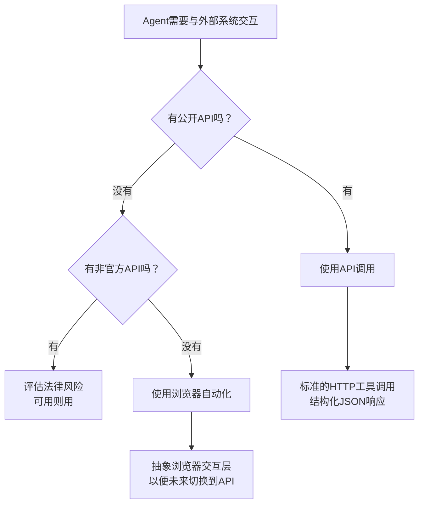

# API优先 vs 浏览器自动化——Agent工具选型决策指南

## 🎯 核心洞察

> 来源: Dev.to — "Browser delegation is not a replacement for clean APIs"

### 核心问题

许多Agent开发者倾向于使用「浏览器自动化」（截屏→理解→点击）来操作网站，而不是用API调用。但这是反模式的：

```yaml
# ❌ 常见错误思路
Agent需要获取某个数据 → 
  打开浏览器 → 导航到页面 → 等待渲染 → 
  截屏 → 视觉分析 → 找到元素 → 点击/提取

# ✅ 正确思路  
Agent需要获取某个数据 →
  检查是否有公开API → 如果有：直接API调用 →
  如果没有：考虑浏览器自动化（同时接受其脆弱性）
```

### 为什么API优于浏览器自动化

| 维度 | API调用 | 浏览器自动化 | 
|------|---------|-------------|
| 速度 | 50-200ms | 2-10秒（需加载JS/渲染） |
| 稳定性 | 99.9%+ | 60-80%（受UI变更影响） |
| 维护成本 | 低（API版本化） | 高（CSS选择器/XPath会过时） |
| 错误处理 | 标准HTTP状态码 | 需要处理超时/布局变化/CAPTCHA |
| Token消耗 | 低 | 高（截屏需要视觉模型） |
| AI理解难度 | 结构化JSON | 截屏分析 |

## 📋 决策框架

### 第1步：检查API可用性

```yaml
# 按照以下优先级检查
api_availability_check:
  level_1_public_api:
    - 搜索"[服务名] API"或"[服务名] developer portal"
    - 检查API文档是否完整
    - 确认鉴权方式（API Key / OAuth / JWT）
    
  level_2_unofficial_api:
    - 搜索GitHub上是否有反向工程的API封装
    - 注意：使用非官方API可能违反服务协议
    
  level_3_no_api:
    - 确定只能走浏览器自动化
    - 准备接受浏览器自动化的所有缺陷
```

### 第2步：浏览器自动化的降级策略

```yaml
# 当你不得不使用浏览器自动化时
browser_fallback_decision:
  使用条件:
    - 该服务没有提供API
    - 或者API的调用成本远高于浏览器自动化
    - 或者需要操作的界面无法通过API完成
  不接受的条件:
    - 仅仅因为"懒得读API文档"
    - 仅仅因为"浏览器更酷"
    - 仅仅因为"视觉Agent更AI原生"
```

### 第3步：决策流程



## 🔧 Hermes Agent实操指南

### 在Hermes中配置API调用优先

```yaml
# Hermes config.yaml 或 project config
tool_selection:
  priority:
    - web_search          # 搜索API
    - http_request         # 调用REST API
    - terminal             # 本地工具
    - web_fetch            # 获取网页内容（非浏览器）
    - vision_analyze       # 视觉分析（最后手段）
```

### 浏览器自动化的封装模式

```python
# 当你必须用浏览器时，把浏览器交互封装成可替换的接口
class ExternalServiceClient:
    """
    外部服务客户端——优先尝试API，fallback到浏览器
    """
    
    def __init__(self):
        self.api_client = ApiClient()      # API客户端（首选）
        self.browser = BrowserAgent()      # 浏览器Agent（备用）
    
    def get_data(self, query: str) -> dict:
        """获取数据：优先API，失败后fallback到浏览器"""
        
        # 方案A：API调用
        try:
            result = self.api_client.search(query)
            if result.success:
                return result.data
        except ApiException as e:
            self._log_api_failure(e)
        
        # 方案B：浏览器自动化
        try:
            result = self.browser.navigate_and_extract(
                url=self.BASE_URL,
                query=query,
                timeout=30  # 浏览器操作需要更长超时
            )
            return result
        except BrowserException as e:
            self._log_browser_failure(e)
            raise ServiceUnavailable("所有访问方式都失败了")
    
    def _log_api_failure(self, e):
        """记录API失败——可能需要关注API变更"""
        logger.warning(f"API failed, falling back to browser: {e}")
    
    def _log_browser_failure(self, e):
        """记录浏览器失败——可能需要关注UI变更"""
        logger.error(f"Browser automation also failed: {e}")
```

## ⚡ 速度与成本对比

### 真实数据（来自Reflex Blog测试）

| 操作模式 | 单次操作耗时 | 成功率 | 成本对比 | 
|----------|------------|--------|---------|
| API调用（结构化端点） | ~0.1秒 | >99% | 1x（基准） |
| 浏览器截图+视觉理解 | 3-10秒 | 60-80% | 45倍于API |
| 浏览器点击操作 | 5-15秒 | 50-70% | 50倍于API |

### Hermes中具体场景的选型建议

```yaml
# 常见场景的推荐方案
scenarios:
  搜索信息:
    推荐: web_search API ❌ 浏览器搜索
    原因: 搜索API 0.5秒完成，浏览器需要3-10秒
    成本: API约1/45的浏览器方案成本
  
  获取网页内容:
    推荐: web_fetch（获取HTML） ❌ 浏览器截屏
    原因: HTML解析快准稳，视觉分析会误解布局
  
  操作需要登录的网站:
    推荐: 优先看是否有API ❌ 浏览器自动登录
    原因: 浏览器处理验证码/Cookie/CAPTCHA极其脆弱
  
  监控页面变化:
    推荐: 服务器端HTML比较 ❌ 浏览器定时截屏
    原因: 服务器端比较稳定且无渲染开销
```

## 💡 浏览器自动化的「唯一正确用法」

当你确实只能用浏览器时：

```yaml
browser_automation_good_practices:
  1. 抽象交互层:
     - 创建一个Service接口
     - 浏览器实现只是其中一个实现
     - 当API开放时，可以无缝切换
     
  2. 健壮的选择器策略:
     - 优先用data-testid属性（不随UI变化）
     - 其次用文本内容
     - 避免用CSS class（经常变）
     - 避免用DOM层级（重构会变）
     
  3. 定期测试:
     - 每天早上跑一次自动化测试
     - 如果失败，立刻检查UI是否变更
     
  4. 为失败做准备:
     - 超时后自动重试（最多3次）
     - 每次失败都记录截图
     - 持续失败时通知人工
```

## ⚠️ 常见陷阱

1. **「用浏览器更AI原生」是伪命题** — AI理解JSON比理解截图容易得多，结构化数据不需要视觉分析
2. **浏览器自动化会引入CAPTCHA** — 频繁的浏览器自动化可能触发反爬虫机制
3. **不要忽视API的可用性** — 很多时候文档写了但不是你想要的功能，先验证再决定
4. **UI小型改动就会导致Agent失败** — 一个按钮从"确定"改为"确认"，你的Agent就挂了
5. **成本基准被忽视** — 浏览器操作多出的45倍成本很少被人算进去（参见agent-auto-vision-vs-api-cost）
