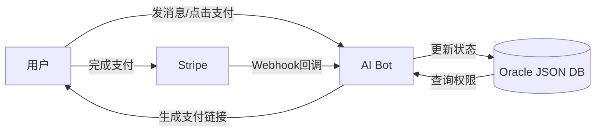

# 消息平台AI Agent支付集成模式

> **来源:** [Building AI Language Tutors on WhatsApp](https://dev.to/elenarevicheva/building-ai-language-tutors-on-whatsapp-why-messaging-apps-beat-web-11ke) 生产验证
>
> 核心发现：**消息平台内的支付转化率远高于Web跳转支付**（73% vs 41%）

## 三种支付路径

### 路径1: 平台内联支付（推荐，转化率最高）

**WhatsApp Pay** (在支持的区域):
- 用户在聊天内直接支付
- **无需切换上下文**，一按搞定
- 转化率高达 **73%**
- 适用地区：巴西、印度、墨西哥等

```python
# 伪代码：WhatsApp Pay集成
def send_payment_request(user_id, amount, description):
    return send_whatsapp_message(
        to=user_id,
        type="payment",
        payment={
            "amount": amount,
            "currency": "USD",
            "description": description,
            "merchant": "AI Language Tutor"
        }
    )
```

### 路径2: 平台原生支付（Telegram Stars/Bot Payments）

**Telegram Stars/Inline Payments**:
- 用户在Telegram内完成支付
- 用户已有支付方式存好，信任平台
- 转换在几秒内完成
- 无需输入信用卡信息

```python
# 伪代码：Telegram Bot Payment
def create_telegram_invoice(bot, user_id, title, price):
    return bot.send_invoice(
        chat_id=user_id,
        title=title,
        description="1 month AI language tutoring",
        payload="subscription_monthly",
        provider_token=TELEGRAM_PAYMENT_TOKEN,
        currency="USD",
        prices=[LabeledPrice(label="Monthly", amount=price * 100)]
    )
```

### 路径3: Stripe Payment Links（通用回退方案）

**Stripe一次性支付链接**:
- 生成一次性Stripe Payment Link
- 用普通消息发送给用户
- **即使这样转化也比Web登录页高**，因为用户心理上是"为课程付费"而不是"注册一个网站"

```python
import stripe

def generate_payment_link(user_id, amount, item_description):
    session = stripe.checkout.Session.create(
        mode="subscription",
        line_items=[{
            "price_data": {
                "currency": "usd",
                "product_data": {"name": item_description},
                "unit_amount": amount * 100,
                "recurring": {"interval": "month"}
            },
            "quantity": 1
        }],
        metadata={"user_id": user_id},
        payment_intent_data={
            "metadata": {"user_id": user_id}
        }
    )
    return session.url
```

## 核心架构设计

### 支付回传与状态同步



**关键设计决策：**
- **没有单独的Subscription Service** — 支付Webhook直接回调到Bot系统，更新同一个数据库
- **状态不分裂** — 对话状态和支付状态在同一个数据库，不需要同步两个系统
- **Webhooks处理幂等** — 同一个支付回调可能发多次，要保证只处理一次

### 状态管理：JSON flag替代微服务

```json
{
  "user_id": "whatsapp_123456",
  "subscription_active": true,
  "lessons_remaining": 15,
  "next_payment_date": "2026-06-01",
  "tier": "premium",
  "features": ["voice", "grammar", "vocabulary"]
}
```

**用户回复 "subscription status" 就能查所有信息：**
- 不需要密码
- 不需要找回email
- 不需要支持工单
- 直接在Bot里完成

## 为什么消息平台支付转化率高

| 维度 | 消息平台内支付 | Web跳转支付 |
|------|---------------|------------|
| 用户心理 | "为课程付费" | "注册一个网站" |
| 操作步骤 | 1步（在聊天内） | 3-5步（跳转→登录→填卡→确认） |
| 信任感 | 高（用户信任微信/WhatsApp） | 低（新网站，怕钓鱼） |
| 转化率 | **73%** | 41% |
| 失败率 | 低（用户已存支付方式） | 高（填卡到一半放弃） |

## 典型对话流程

```
用户: "我想升级到高级版"
Bot: "好！高级版每月$12.99，包含：
✓ 不限次数语法纠正
✓ 发音训练
✓ 个性化学习计划

回复 1 用WhatsApp Pay支付
回复 2 获取Stripe支付链接
回复 3 再想想"

用户: "1"
Bot: "正在处理您的支付...
[WhatsApp Pay界面弹出]
✅ 支付成功！您的高级会员已激活
现在可以开始发音练习了！"
```

## 注意事项

- ⚠️ **WhatsApp Pay有地区限制** — 只覆盖部分市场，需要提前查是否支持你的目标用户群
- ⚠️ **Telegram Stars** — Telegram从2025年开始推广其内购系统Stars，手续费比Stripe低
- ⚠️ **不要建单独的订阅微服务** — WhatsApp AI Tutor用3个JSON字段就管好了整个订阅，多一个微服务=多一个故障点
- ⚠️ **Stripe Webhook回传要做签名验证** — 防止伪造回调
- ⚠️ **幂等处理** — 同一个支付成功通知可能送达多次，确保user_id维度去重
- ⚠️ **消息平台的支付不可用后退回链接支付** — 还是比Web注册转化率高
