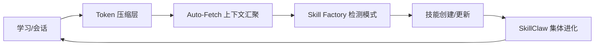

# OpenHuman 参考技能

> 来源：https://github.com/tinyhumansai/openhuman
> 作者：TinyHumans AI (@senamakel)
> 版本参考：Early Beta (2026-05)
> 用途：学习OpenHuman的设计思路，提炼可借鉴到Hermes系统的模式

---

## 一、项目定位

OpenHuman 是一个**开源桌面 AI 智能体**，口号是"Your Personal AI super intelligence"。区别于 Hermes（云端终端 Agent）和 Claude Code（终端编码 Agent），OpenHuman 走的是**桌面 App + UI 优先 + 吉样物人格化**路线。

**一句话概括：有脸的 AI 助手，自动认识你的一切。**

---

## 二、核心架构

| 层 | 技术栈 | 说明 |
|----|--------|------|
| 前端 | React + Vite (TypeScript) | 桌面UI |
| 桌面壳 | Tauri (Rust) | 跨平台 Windows/macOS/Linux |
| 核心服务 | Rust (`openhuman_core`) | JSON-RPC, JS Runtime, channels, memory |
| 技能系统 | Node.js 运行时 | skills/ 目录，消费型包 |
| 数据层 | SQLite (本地) + Obsidian vault | 记忆树持久化 |

**特点：** 单手仓(co-located monorepo)，Rust 做底层，React 做 UI，Node.js 运行技能。

---

## 三、最值得借鉴的 5 个设计模式

### 1. Auto-Fetch（自动数据拉取）

**核心逻辑：** 每 20 分钟遍历所有已连接的服务，拉取最新数据到本地记忆树。

```
┌─────────────┐   每隔20分钟    ┌──────────────┐
│ Gmail       │ ─────────────> │              │
│ Notion      │ ─────────────> │   Memory     │
│ GitHub      │ ─────────────> │   Tree       │
│ Slack       │ ─────────────> │  (SQLite)    │
│ Calendar    │ ─────────────> │              │
│ Linear/Jira │ ─────────────> │              │
└─────────────┘               └──────────────┘
```

**可借鉴到 Hermes：** 
- 我们已有 cron 定时任务 + 自动学习，但 Auto-Fetch 可以补充为"定时从已连接平台拉增量数据"
- 飞书群里的聊天记录、用户分享的链接、技能更新日志都可以自动拉取

### 2. Memory Tree（记忆树）+ Obsidian Wiki

**核心逻辑：** 
- 所有连接的数据被**规范化为 ≤3k token 的 Markdown 块**
- 按质量打分后折叠进**层级摘要树**
- 存到本地 SQLite + 同步生成 Obsidian 兼容的 `.md` 文件
- 用户可以直接打开 Obsidian 浏览/编辑

```
输入数据（邮件/文档/聊天）
    ↓
规范化为 Markdown 块（≤3k token）
    ↓
质量评分 → 折叠进层级摘要树
    ↓
SQLite 持久化  +  生成 Obsidian 兼容 .md 文件
```

**可借鉴到 Hermes：**  
- 我们的 memory 是纯文本 KV 存储（2200 字符限制），可以借鉴这种"结构化记忆树"
- Obsidian vault 同步功能让用户能直接翻看 AI 的记忆，增加透明度和可控性

### 3. TokenJuice（智能 Token 压缩）

**核心逻辑：** 所有进入 LLM 的数据（工具返回、抓取结果、邮件正文、搜索结果）先过压缩层：

| 操作 | 效果 |
|------|------|
| HTML → Markdown | 去掉标签，保留结构 |
| 长 URL 缩短 | 用短 ID 替代 |
| 去除非 ASCII 字符 | 减少编码浪费 |
| 重复内容去重 | 相同信息只保留一次 |

**效果：成本降低最高 80%，延迟同步降低。**

**可借鉴到 Hermes：** 
- 我们目前没有显式的 token 压缩层，工具返回的原始数据直接进上下文
- 可以在技能输出、搜索返回、文件读取后加一级压缩

### 4. 桌面吉祥物（Mascot）体验设计

**核心特点：**
- 一个有脸的角色，在桌面上显示
- 会说话、感知周围环境
- **作为真人参加 Google Meet 会议**
- 会记住你跨周的对话
- 即使你停止打字，它也在后台继续思考

**可借鉴到 Hermes：**
- 飞书 Bot 目前是纯文字回复，可以增加"状态感知"——比如"思考中"、"正在查资料"、"发现一个问题"
- 9527 的飞书 Bot 可以增加更多互动反馈（输入中进行、分步展示思考过程）

### 5. 118+ 第三方一键 OAuth 集成

**核心逻辑：** 
- Gmail / Notion / GitHub / Slack / Stripe / Calendar / Drive / Linear / Jira 等
- 一键 OAuth 授权
- 每个连接自动暴露为 Agent 的**类型化工具**
- 无需手动配置 API Key

**可借鉴到 Hermes：**
- 我们的 tool 系统可以通过 skill 扩展，但集成需要手动配置 API Key
- 可以学这种"即连即用"模式——飞书 OAuth 登录后自动启用对应工具

---

## 四、OpenHuman vs Hermes 对比

| 维度 | OpenHuman | Hermes Agent（我们） |
|------|----------|-------------------|
| **定位** | 桌面个人 AI 助手 | 企业级 Agent 网关 |
| **部署** | 桌面 App（Win/Mac/Linux） | 云端服务器 |
| **UI** | 图形界面 + 吉祥物 | 飞书/Telegram 聊天 + CLI |
| **技能** | Node.js 运行时技能包 | Markdown SKILL.md 技能 |
| **记忆** | 记忆树 + SQLite + Obsidian | 持久 memory + session_search |
| **数据接入** | Auto-Fetch 20min 轮询 | 手动配置/用户提供 |
| **模型路由** | 内置（推理/快速/视觉） | 手动切换 provider |
| **成本控制** | TokenJuice 压缩 | 无内置压缩 |
| **团队架构** | 单人助手 | 多 Agent 团队（CEO/运营/内容/运维） |
| **开源协议** | GPL-3.0 | MIT |

---

## 五、OpenHuman vs 其他主流方案（摘自官方README）

| | Claude Cowork | OpenClaw | Hermes Agent | OpenHuman |
|---|---|---|---|---|
| **开源** | ❌ 闭源 | ✅ MIT | ✅ MIT | ✅ GPL-3.0 |
| **开机即用** | ✅ 桌面+CLI | ⚠️ 终端优先 | ⚠️ 终端优先 | ✅ 几分钟配好 |
| **记忆** | 聊天范围 | 插件依赖 | 自学型 | 🚀 记忆树+Obsidian |
| **集成** | 几个连接器 | 自带 | 自带 | 🚀 118+ OAuth |
| **Auto-Fetch** | ❌ 无 | ❌ 无 | ❌ 无 | ✅ 20分钟同步 |
| **模型路由** | 单模型 | 手动 | 手动 | ✅ 内置 |

---

## 六、技能生态全景：从学习到进化的完整链路

OpenHuman 的启发让我们建立起完整的技能生命周期系统。以下是当前技能生态全景：



| 环节 | 工具 | 说明 |
|------|------|------|
| 📥 数据压缩 | Token 压缩层 | 工具返回数据先压缩再进上下文 |
| 📡 上下文汇聚 | Auto-Fetch | 每20分钟扫技能库+系统状态→日报 |
| 🏭 模式检测 | Skill Factory | 静默观察工作流→自动提议技能 |
| 🧬 技能进化 | SkillClaw | 从会话数据去重/改进/版本/共享 |

## 七、对我们的启发总结

| # | 启发 | 可落地性 | 优先级 | 状态 |
|---|------|---------|:------:|:----:|
| 1 | **Token 压缩层**——工具返回数据先压缩再进上下文 | 高（纯代码改动） | 🔥 高 | ✅ **已实现** |
| 2 | **Auto-Fetch 定时汇聚上下文到本地** | 高（已有 cron 系统） | 🔥 高 | ✅ **已实现** |
| 3 | **结构化记忆树**——把 memory 升级为多层摘要结构 | 中（需改 memory 系统） | ⭐ 中 | ⏳ 待做 |
| 4 | **吉祥物/状态反馈**——飞书 Bot 增加"正在感知"交互 | 低（改飞书 Bot） | 低 | ⏳ 待做 |
| 5 | **一键 OAuth 集成**——简化工具接入方式 | 低（架构改动大） | 低 | ⏳ 待做 |

### 已实现项目详情

| 项目 | 脚本 | 对应技能 | 定时任务 | 压缩率 |
|------|------|---------|---------|:------:|
| **Token 压缩层** | `token_compression.py` | `token-compression` (meta-skills) | 无（按需调用） | HTML 98% / JSON 99% / 文本 40% |
| **Auto-Fetch** | `auto_fetch.py` | `auto-fetch` (meta-skills) | 每 20 分钟 | 311 技能 + 系统状态日报 |

实现原理：`from token_compression import compress` 压缩工具返回数据再送 LLM。
Auto-Fetch 每 20 分钟扫描全技能库+系统状态→汇聚到 `auto-fetch/latest_summary.md`。

## 八、相关链接

- 实现日志：`references/implementation-log.md`
- GitHub: https://github.com/tinyhumansai/openhuman
- 官网: https://tinyhumans.ai/openhuman
- 文档: https://tinyhumans.gitbook.io/openhuman/
- 作者: https://x.com/senamakel
- 实现参考：`meta-skills/token-compression` | `meta-skills/auto-fetch` | `meta-skills/skill-factory`
