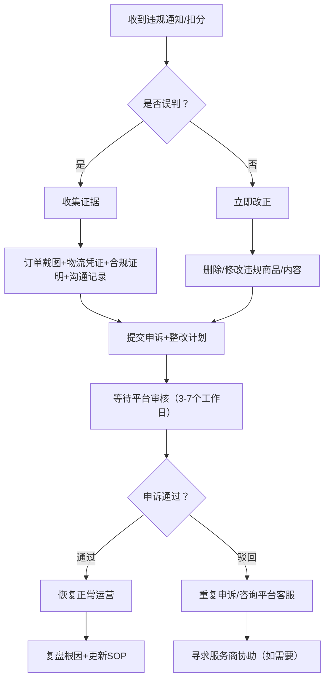

# 东南亚跨境三平台合规与风控防封体系

## 🔥 2026年大背景：合规风暴全面到来

2026年第二季度起，TikTok Shop东南亚全面收紧政策，Shopee持续强化扣分机制，Lazada紧跟阿里系合规体系。三大平台共同特征：
- **从粗放增长 → 精细化合规运营**
- **从"铺货即出单" → "品牌化+本地化"**
- **从灰色操作 → 强监管零容忍**

**核心信号：** 不懂规则的卖家正在被加速淘汰，先吃透规则的人反而在洗牌中建立壁垒。

**2026年5月关键市场数据（墨腾创投2026报告）：**
- 东南亚电商GMV达 **1576亿美元**，同比增长 **22.8%**，是五年前规模的近三倍
- **Shopee 53%**、**TikTok Shop(含Tokopedia) 29%**、**Lazada 16%**，三家合计 **98.8%** 
- 印尼仍是最大市场（占37%），但增速放缓至2.2%；**泰国+51.8%**、**马来西亚+47.6%** 领跑
- 平台抽佣率升至约 **13.5%**，卖家实际承担广告+物流+补贴总成本往往 **超过30%**
- 预计到2029年东南亚电商市场达2898亿美元，CAGR 13.2%

---

## 一、TikTok Shop 东南亚合规体系（2026最新）

### 1.1 2026年重大政策变化

| 变化领域 | 具体措施 | 影响 |
|---------|---------|------|
| **内容审核升级** | 静态图片/幻灯片/无口头解说的视频被降权 | 内容必须真人出镜或高质量制作 |
| **本地退货仓强制** | 东南亚各站点必须配置本地退货地址 | 无本地仓→订单拦截、延迟结算 |
| **履约时效收紧** | 海外仓订单2个工作日内发货，6日送达 | 跨境直发几乎无法达标 |
| **保证金调整** | 多站点提高保证金 | 资金门槛提高 |
| **SPS体验分** | 店铺体验分直接影响流量分配和保证金额度 | 好评率、履约率成为核心资产 |
| **"一商卖全球"** | 新增"内容全球分发"和"跨店一键铺品"功能 | 合规卖家可一个内容分发多国 |
| **AHR账号健康分** | 2026年7月起全面取代违规分体系（5月可预览） | 从"只扣分"到"可加分"，200个完美订单自动加分 |

### 1.2 TikTok Shop 红线行为（触碰直接封店）

| 红线 | 说明 | 处罚 |
|------|------|------|
| **售假/仿品** | 销售假冒品牌商品 | 永久关闭店铺 |
| **虚假宣传** | 夸大功效、虚假使用效果对比 | 降权→封店 |
| **刷单/虚假交易** | 人为提升销量和评价 | 禁止提现、封店 |
| **诱导性内容** | "点击购物车送XX"等诱导行为 | 内容下架+扣分 |
| **侵权内容** | 未授权使用他人图片/视频/音乐 | 内容下架+扣分 |
| **低质量内容** | 静态幻灯片、无互动视频（4月24日起严查） | 降权、限流 |
| **虚假发货** | 上传假物流单号 | 延长账期+高额罚款 |

### 1.3 2026年TikTok Shop卖家生存策略

```
内容质量 > 内容数量          ← 从"量"转向"质"
本地化物流 > 跨境直发        ← 海外仓+本地退货仓
店铺体验分 > 单品爆款        ← SPS成为核心资产
合规运营 > 野蛮增长          ← 先求稳再求量
AHR健康分 > 短期销量         ← 可持续经营的新基准
```

**实操建议：**
1. **每周自查SPS（店铺体验分）**，及时处理预警和差评
2. **配置至少1个东南亚本地退货仓**（可通过第三方海外仓）
3. **视频内容要有真人出镜或高质量AI数字人**，避免纯幻灯片
4. **商品页信息（原产国、制造商）必须真实完整**
5. **保证金政策关注站内信通知**，及时补交
6. **2026年5月起立即预览AHR健康分**，利用5-6月缓冲期诊断修复历史问题
7. **善用AHR考试机制**：触发150/100/50/0分节点时，参加平台考试可缩短处罚时长
8. **追求完美订单**：每200个完美订单（无退换/取消/延迟）可获AHR自动加分

---

## 二、Shopee 合规与罚分体系（2026最新）

### 2.1 罚分规则

| 扣分 | 后果 | 累计触发节点 |
|------|------|------------|
| 1分 | 进入观察期 | — |
| 3分 | 商品下架、部分功能受限 | 首次触发即下架 |
| 6分 | 搜索曝光降低50%+、不能参与大促 | 多数卖家开始感受影响 |
| 9分 | 限制发货权限、广告关闭、限制提现 | 运营基本停摆 |
| 12分 | 店铺冻结30天 | 申诉后可能恢复 |
| 15分 | 永久关闭 | 无法恢复 |

⚠️ **注意：** 分每季度清零一次，但累计处罚记录影响店铺权重长期恢复

### 2.2 高频扣分项（2026新规重点）

| 违规类型 | 具体行为 | 扣分力度 |
|---------|---------|---------|
| **延迟发货LSR** | 订单未在DTS内完成首公里扫描 | 2026严格考核，各站点标准不同（见下文） |
| **订单未完成率** | 卖家原因取消订单 | 高频扣分（重灾区） |
| **商品描述不符** | 变体信息不清晰、尺码/颜色不实 | 下架+扣分 |
| **侵权/售假** | 仿牌、盗图、盗用商标 | 严重扣分 |
| **虚假促销** | 虚假限时、免运费门槛不透明 | 广告工具受限 |
| **客服响应慢** | 聊聊回复率低、响应时长超标 | 店铺权重下降 |
| **快速交接率FHR** | **2026.5.11起马来西亚本土店新增扣分项** | FHR<90%→罚1分+物流降级 |
| **禁售类目** | 平台禁售品类上架 | 直接下架+扣分 |

### 2.3 Shopee各站点LSR门槛标准（2026年5月最新）

| 站点 | LSR门槛 | 生效时间 | 备注 |
|------|---------|---------|------|
| **新加坡站** | 5% | 2026.3.10起 | 从10%收紧至5% |
| **马来西亚站** | 10% | 2026.4.8起 | 从5%调回10%（缓解卖家压力） |
| **菲律宾站** | 10% | 2026.3.14起 | NFR和LSR达到10%即计分 |
| **泰国站** | 15% | 2025.9.1起 | 相对宽松 |
| **越南站** | 各品类不同 | — | 结合新固定费用标准考核 |

### 2.4 FHR快速交接率——2026年5月新增扣分维度

**Shopee马来西亚本土店2026年5月11日生效：**

| FHR标准 | 扣分 | 后果 |
|---------|------|------|
| FHR < 90% | 罚1分 | 物流渠道优先级降低 |
| FHR持续不达标 | 累计扣分 | 优选卖家资格受影响 |

**FHR定义**：近30天包裹在规定时效内交给Shopee合作物流并完成扫描的占比。
**核心影响**：尾程配送效率成为新考核维度。卖家需要优化打包→交接的全流程时效。

### 2.5 2026年Shopee重大趋势

- **跨境直发加速淘汰**：海外仓成生存底线，搜索排名提升3-5位
- **5%技术支持费全面落地**：2026年2月起新加坡、马来西亚、泰国、越南四站跨境卖家统一收取
- **快速交接率(FHR)正式纳入罚分**：马来西亚先行，其他站点可能跟进
- **大量封店潮（越南等）**：资料不完备卖家被集中清理，7万卖家离场
- **本地运营权重上升**：本地退换货能力直接影响店铺权重
- **商城卖家"隔日到货"缓冲期**：期间扣分可申请豁免

### 2.6 Shopee卖家日常自查清单

```
□ 每日：查看罚分通知、聊聊回复率、未完成订单
□ 每周：检查LSR（延迟发货率）是否达标（按站点标准）
□ 每周：核查Listing是否有描述不符
□ 每月：检查商品是否涉及禁售/侵权风险
□ 每月：更新库存和备货计划
□ 每月：检查FHR（快速交接率）是否≥90%（马来西亚站）
□ 每季：罚分清零前全面复查所有违规项
```

---

## 三、Lazada 扣分与合规体系

### 3.1 扣分体系

| 扣分 | 后果 | 备注 |
|------|------|------|
| 12分 | 限制12项卖家权益 | 含促销、广告等核心功能 |
| 24分 | 限制更多权益 + 降权 | 搜索曝光大幅降低 |
| 36分 | 店铺暂停7天 | 严重警告 |
| 48分 | **账户永久停用，无法申诉恢复** | 最严重处罚 |

### 3.2 主要扣分项

| 违规类型 | 具体行为 | 扣分 |
|---------|---------|------|
| 售假/仿品 | 销售假冒品牌商品 | 48分（直接封） |
| 商品质量不符 | 描述与实物严重不符 | 12-24分 |
| 延迟发货 | 未在SLA内完成发货扫描 | 2-6分/次 |
| 虚假发货 | 上传虚假物流单号 | 12分/次 |
| 知识产权侵权 | 未授权使用他人内容 | 24-48分 |
| 重复上架 | 相同商品多个Listing | 2分/次 |
| 禁售类目 | 上架平台禁止品类 | 下架+扣分 |

### 3.3 Lazada独特优势

- **AI应用最早最深入**：AI智能导购用户近1亿，超50%商品详情页应用AI，开通AI客服店铺超33万
- **阿里系合规体系完整**：但规则也最细致复杂
- **LazMall品牌流量加权**：品牌卖家更有优势
- **"天猫一键轻出海"项目**：已超8000家天猫商家入驻，累计GMV破1亿美元
- **单位经济效益持续提升**：有望下财年实现单季盈利（阿里巴巴财报透露）
- **⚠️ 2026年注意**：TikTok Shop在越南/印尼已将Lazada挤到第三，市场份额在缩水；新加坡是唯一增长市场

---

## 四、多账号防关联体系（三平台通用）

### 4.1 什么会导致关联封店

平台通过检测以下维度判断是否为同一人操作（三平台通用）：

| 检测维度 | 说明 |
|---------|------|
| **IP地址** | 同一IP登录多个账号→关联 |
| **浏览器指纹** | Canvas、WebGL、Audio、字体、分辨率、时区、UA |
| **Cookie缓存** | 同一浏览器环境登录多账号→关联 |
| **注册信息** | 相同手机号/邮箱/身份证/营业执照（同一实体） |
| **支付账户** | 相同收款账户（Payoneer/PingPong等） |
| **物流信息** | 相同发货地址、退货地址 |
| **产品重叠度** | 多个店铺上架完全相同产品 |

### 4.2 防关联三大层次

```
第一层：硬件隔离（最安全）
   → 每账号独立电脑/手机 + 独立网线/4G
   → 费用高，适合大卖家

第二层：指纹浏览器（性价比最高）
   → 飞跨浏览器/洋淘指纹浏览器/候鸟浏览器
   → 每个店铺一个独立环境（独立IP+独立指纹）
   → 每账号成本约20-50元/月

第三层：虚拟机隔离（中等风险）
   → 虚拟机+独立IP代理
   → 有一定关联风险，不推荐长期操作
```

### 4.3 2026年防关联新挑战

- **平台升级风控系统**：新增浏览器环境特征动态核验规则
- **Canvas指纹**：每个浏览器环境生成唯一Canvas指纹，平台可检测
- **WebRTC泄露**：可能暴露真实IP（即使挂了代理）
- **时间戳+时区一致性**：所有操作必须与目标国时区一致

### 4.4 最低成本防关联方案（新手适用）

```
步骤1：注册隔离 → 每店铺用不同手机号+邮箱+个体户执照
步骤2：环境隔离 → 用飞跨浏览器/候鸟浏览器（免费版可管理2-3店）
步骤3：IP隔离 → 每店铺搭配独立IP（Lumiati/911S5等，约30元/月/IP）
步骤4：收款隔离 → 每店铺用不同账户收款（Payoneer可多子账户）
步骤5：运营隔离 → 不同店铺上架不同产品线，降低重叠
```

---

## 五、三大平台合规对比速查

| 维度 | TikTok Shop | Shopee | Lazada |
|------|-------------|--------|--------|
| 最大风险点 | 内容质量+退货仓+AHR健康分 | 延迟发货LSR+FHR | 售假48分封店 |
| 扣分上限 | AHR 0分=封店 | 15分永久封 | 48分永久封 |
| 保证金 | 各站点不同（1500美元+） | 0（免入驻费） | 0-高（视品类） |
| 内容要求 | **最高**（强内容导向） | 中 | 低 |
| 本地化要求 | **极高**（退货仓强制） | 高（海外仓成必选项） | 中 |
| AI工具加持 | 强（AI推荐占35%成交） | 中 | **最强**（阿里AI体系，亿级用户） |
| 新手友好度 | 需内容能力 | **最高** | 中 |
| 费用趋势 | 持续上升（越南6%/泰国8.03%） | 新增5%技术支持费+LSR收紧 | 相对稳定 |

---

## 六、【2026年5月最新政策变化速递——第五轮深度更新 v5.0】

以下为2026年5月期间最新生效/即将生效的各平台政策变化，涵盖从出海网、雨果跨境、AMZ123等权威跨境资讯平台采集的5月新规：

### 6.1 TikTok Shop 最新政策（2026年5月新增/更新）

| 时间节点 | 政策内容 | 影响及应对 |
|---------|---------|-----------|
| **2026.4.24** | 东南亚全境整治低质量内容——7天内发布5条及以上被判定无互动/误导性视频，限制7天内最多发7条带货视频 | 铺量打法彻底失效，每条视频都须有互动、口播或实质性信息 |
| **2026.4.10** | "一商卖全球"升级，新增"内容全球分发"（美区视频自动翻译一键分发多国）和"跨店一键铺品"（同步核心商品信息） | 合规卖家可一次性产出内容分发全球，运营效率质变 |
| **2026.5月(预览期)→7月(正式)** | **账号健康分AHR全面取代违规分**：0-1000分制（初始200分），三色标签（绿200-1000正常/橙50-199预警/红0-49高风险），**审核覆盖最近90天经营数据** | 从"只扣分"到"可加分"；**关键机制**：①触发150/100/50/0分节点时可参加**平台考试缩短处罚时长**；②每200个**完美订单**(无退换/取消/延迟)可获AHR自动加分；③利用5-6月预览窗口期提前诊断修复历史问题 |
| **2026.5.6** | 泰国站商业增长费用上调：电子类5.89%→6.96%，非电子类6.96%→8.03%（单件最高199泰铢） | 利润承压，需调整定价策略 |
| **2026.5.9** | **越南站重磅调整**：①交易手续费从5.0%上调至**6.0%**；② Marketplace卖家默认佣金**12.50%**，Mall卖家**15.50%**；③部分品类固定佣金费率调整 | 越南站运营成本大幅上升，综合费率逼近20%+ |
| **2026.5.9** | **TikTok Shop东南亚推出「亿元直通车」大卖招募计划**——面向抖音(TMall年销≥2500万元)或其他平台(Shopee/Lazada/Amazon/Temu年销≥800万元)成熟大卖。权益：最长120天佣金减免、每月最高1.5万美元商品货补、单月最高1万美元广告激励金、专属客户经理1对1、提前解除新手村限单考察豁免、跨境直邮/本地仓/一品多仓灵活物流、大促达人资源优先。2025年参与JBP项目商家超半数首次销售额亿元级突破，平均年增速超150% | 平台正式从「招商」转向「抢商」阶段，中腰部以上大卖在2026年Q2可借窗口期获得大量资源倾斜。 |
| **2026.5.10** | **TikTok Shop发布跨境POP「商家成长服务计划」**——一价全包模式，固定费用6000美元+20%订单佣金。覆盖平台推荐费(6%)、智能营销(3.5-4.5%)、联盟达人佣金、平台广告代投。承诺产出优质达人短视频+AIGC内容+ROAS≥2。未达承诺返还固定费用20-50%广告金。基于算法筛选高潜力商家定向开放报名入口 | 平台正式切入「代运营+保障」模式，对供应链强但运营弱的商家有明确价值，但6000美元固定费用门槛不低。报名后营销工具权限被冻结，由平台智能操作 |
| **2026.5月（新披露）** | **TikTok Shop菲律宾本土店增设"商家成长服务费"** | 菲律宾本土店费用进一步叠加，需重新核算F&L模型 |
| **2026.6月起（新披露）** | **TikTok Shop美区：买家责任退货运费全部由商家承担** | 退货成本从"买家承担部分"变为**全部商家兜底**，退货率高的品类（服饰、鞋靴）利润空间被大幅压缩。**应对**：①优化商品描述和尺码表，降低非质量退货；②引入退货保险分摊风险；③提高定价中预留退货损耗系数 |
| **2026.5月** | **TikTok Shop by Tokopedia推出"走向全球（Lokal Mendunia）"计划**——50个印尼本土品牌出海东南亚，其中35个正加速拓展区域市场 | 这是TikTok Shop**双轮驱动战略**的核心信号：①本土品牌国际化，地理文化相近的清真美妆、时尚、健康、户外品类迎来新机；**关键数据**：参与品牌中6/8实现GMV正增长，部分数日内销售额跃升至两位数甚至三位数；单场12天营销活动直播销售额最高达原先**50倍**，LIVE观看量增长20%-90% |
| **2026.5月（新披露）** | **印尼将修订电商新规**——回应中小卖家投诉，规范平台收费行为 | KPPU反垄断调查持续加压，TikTok Shop在印尼的收费标准可能面临调整，印尼卖家应密切关注政策窗口期，提前准备应对方案 |
| **2026.5月（新披露）** | **泰国广告新规即将落地**——未完成实名认证将无法进行广告投流 | 泰国的广告门槛急剧升级，**测品效率将大幅下降**。应对：①提前完成实名认证；②建立内容储备体系，避免临时赶工；③东南亚其他国家可能跟进此规定 |
| **2026.5月** | **TikTok英国上线"无广告"订阅服务**，月费3.99英镑 | 虽为英国市场，但**试水订阅模式**的信号值得关注——若推广至东南亚，将改变内容分发的广告模式基础 |
| **2026.5月起** | 商家可预览账号健康分(AHR) | **立即行动**：登录后台预览AHR，了解各类经营行为对评分的影响；参加平台考试修复历史扣分记录 |

### 6.2 Shopee 最新政策（2026年5月新增/更新）

| 时间节点 | 政策内容 | 影响及应对 |
|---------|---------|-----------|
| **2026.5.11** | **马来西亚本土店新增"快速交接率(FHR)"扣分规则**——FHR<90%罚1分+物流渠道降级 | **重大变化**：尾程配送效率成新考核维度。定义=近30天包裹在规定时效内交给Shopee合作物流并完成扫描的占比。卖家必须优化打包→交接的全流程时效 |
| **2026.5.18（新增重磅）** | **Shopee大幅提高免费上门揽收服务门槛！** 卖家需**同时满足**以下条件方可享受免费SPS揽收：①快速发货率≥85%；②跨境日均单量≥10单；③**全部订单使用首公里功能**（不得遗漏）；④平均备货时长≤2天；⑤预售商品比例≤10%；⑥首公里错误预报率≤5%；⑦上月罚分≥4分的店铺比例达标 | **史上最严苛揽收政策！** 任一条件不达标即失去免费服务。最容易被忽略的是"全部订单使用首公里功能"——连测试单、小批量单都必须走首公里。**同时，首公里错误预报率判定细则明确**：同一批次订单入仓时间差超24小时或首公里码扫描与入仓时间超24小时→视为错误预报。**应对**：①立即自查上述7项指标；②优化打包流程，确保同一批次同步入仓；③将"首公里使用率"设为打包员KPI |
| **2026.5.18（同步）** | **付费揽收服务补贴降低**——符合条件的卖家可获每单0.1元人民币运费补贴（在"我的收入"查看） | 补贴几乎可忽略不计，实质等于**免费服务大幅缩水** |
| **2026.2.2起** | **新加坡/马来西亚/泰国/越南四站跨境卖家新增5%技术支持费** | 订单完成后自动从销售额扣除，跨境直邮/官方仓/三方仓无一例外 |
| **2026.3.10** | 新加坡站LSR处罚标准从**10%收紧至5%** | 新加坡站卖家每周发货延迟超过5%即被扣分 |
| **2026.3.14** | 菲律宾站NFR和LSR达到10%即计分 | 菲律宾卖家需严格监控发货时效 |
| **2026.4.8** | 马来西亚站LSR门槛从5%**调回10%**（缓解卖家压力） | 大件货物渠道DTS调整，可利用缓冲期优化履约流程 |
| **2026.4-5月** | 商城卖家"隔日到货"条件缓冲期（期间扣分可申请豁免） | 商城卖家需加快建仓，利用缓冲期过渡 |
| **2026.6.1起** | **Shopee泰国本土店销售费率调整**：部分类目手续费率调整为1.5%（不含增值税），非商城本土店基础服务费率从1.09%调整为3.27%（涨幅200%）。商城店佣金费率高达20.33%（含技术服务费） | 泰国站持续涨佣，Shopee卖家跨境成本逼近30%。泰国商家需全力切换本土店模式，或通过海外仓佣金补贴（最高降至2.14%）对冲 |

### 6.3 Lazada 最新动态（2026年5月更新）

| 时间节点 | 政策内容 | 影响及应对 |
|---------|---------|-----------|
| **2026年** | AI全面渗透持续加速：AI智能导购用户近**1亿**，超**50%商品详情页**应用AI，开通AI客服店铺超**33万** | Lazada在AI应用上持续领跑三平台，卖家必须跟上平台AI工具的使用节奏 |
| **2026年** | LazMall品牌流量持续加权 | 品牌化卖家在Lazada更有长期红利 |
| **2026年（新补充）** | 单位经济效益提升，有望实现单季盈利 | 平台盈利能力改善，或意味着费率调整空间收窄。但TikTok Shop在越南/印尼已将Lazada挤到第三，新加坡是唯一增长市场，**品牌卖家在Lazada有差异化优势** |

### 6.3 印尼三国同步涨价——补贴时代正式终结（2026年5月新增重磅章节）

**事件：** 2026年5月1日-2日，印尼电商市场迎来史上最大规模的平台费用集中上调，TikTok Shop、Tokopedia、Shopee三大平台同步实施新规。

| 平台 | 涨价内容 | 具体幅度 | 影响 |
|------|---------|---------|------|
| **TikTok Shop印尼** | 5.1起开征物流服务费 | 按买家实际支付运费比例收取，单笔上限5055印尼盾，卖家全额承担且买家无感知 | 低客单卖家利润被直接压缩超10% |
| **Tokopedia** | 5.1起同步开征物流服务费 | 单笔上限10110印尼盾，卖家全额承担 | 物流成本双重加压 |
| **Shopee印尼** | 5.2起上调佣金+XTRA免运费服务费 | 时尚常规尺寸佣金5.5%→7.5%，特殊尺寸达9%；免运费服务费最高3.5% | 特殊尺寸综合平台成本最高达12.5%，大件家居卖家承压显著 |

**核心影响分析：**
- 印尼65%商家客单价低于5万印尼盾，每单新增物流费直接侵蚀一成利润
- 跨境直发物流成本占比达18%-25%，远高于本地仓8%-12%
- Shopee、TikTok Shop再次「默契涨价」后，印尼站综合费率持续攀升

**卖家五大保卫利润策略：**
1. **切换本地仓履约**：降低尾程成本并获取平台流量倾斜
2. **优化头程物流**：按SKU周转率搭配空运、海运
3. **调整产品结构**：淘汰低毛利SKU、提升客单价
4. **区域差异化定价**：规避偏远地区高运费
5. **多平台+独立站布局**：分散单一平台依赖风险

**底层逻辑：** 平台同步调价背后是三重考量——①补贴时代终结，平台必须实现盈利；②推动卖家本地化履约（对应印尼7月电商法落地）；③加速行业洗牌，淘汰低效卖家。

### 6.4 TikTok Shop东南亚2026年度峰会与亿级领跑团

**2026年5月7日，TikTok Shop东南亚跨境电商年度峰会开幕：**
- 发布《TikTok Shop东南亚跨境出海经营白皮书2.0》
- 首发全新商家入驻扶持政策
- 核心主线：「攀登新高度—锚定全年，找对增长方向」+「跑出加速度—实战落地，掌握可复用打法」
- 特设分层定向闭门专场

**亿级领跑团计划（JBP升级版）：**
- 2025年JBP项目商家超半数首次销售额亿元级突破，平均年增速超150%
- 2026年升级为集中平台优势资源的深度绑定机制
- 面向各品类头部、高潜力合作伙伴

### 6.5 2026年货代暴雷潮——跨境物流系统性危机（2026年5月深度新增）

**核心数据（2026年5月最新）：**
- 2025年三大口岸失信货代超1100家
- 2026年Q1，仅美国市场30多家货代/海外仓暴雷，波及2000+卖家，涉案货值超2亿元
- 深圳/广州/义乌平均每月5-8家中小货代注销或跑路
- 2025年全年海外仓暴雷超30起，波及超4万中国卖家，累计涉案金额超10亿元
- 货代毛利率从2019年20-30%暴跌至3-5%

**暴雷根源（系统性风险共振）：**
1. **低价内卷击穿底线**：美森海派成本9.5元/公斤，报价9.3元/公斤，每公斤亏2毛
2. **违规操作埋雷**：虚开发票、偷逃税款、空单诈骗
3. **资金链断裂**：庞氏运营模式，用新客户预付款填旧账单
4. **深圳税务最严核查**：2026年清明后专项稽查，纯国际货代服务免税，但报关/仓储/装卸/国内运输须按6%缴税；严禁打包开票、私账收款、混合核算

**卖家应对指南：**
- **宁愿选贵但稳定**的货代，绝不碰低价暴雷公司
- **核心指标**：查验合规率、资金流健康度、运营年限
- 货代暴雷→货物被扣→店铺断货→Listing权重暴跌→数月努力白费
- 建立多货代备份机制，分散发货

### 6.6 墨腾创投2026东南亚电商报告核心数据

| 指标 | 数据 | 来源 |
|------|------|------|
| 2025年东南亚电商GMV | 1576亿美元（同比+22.8%） | Momentum Works 2026 |
| 2029年预期市场 | 2898亿美元（CAGR 13.2%） | IDC+2C2P |
| Shopee市占率 | 53%（GMV约832亿美元） | Momentum Works |
| TikTok Shop(含Tokopedia)市占率 | 29%（GMV约456亿美元） | Momentum Works |
| Lazada市占率 | 16%（GMV约250亿美元） | Momentum Works |
| 三平台合计 | 98.8% | Momentum Works |
| 平台抽佣率 | 约13.5%（实际总成本超30%） | Momentum Works |
| 东南亚快递包裹量 | 223亿件（同比+39%） | Momentum Works |
| 印尼增长 | 2.2%（最大市场但增速垫底） | Momentum Works |
| 泰国增长 | +51.8%（增速最快） | Momentum Works |
| 马来西亚增长 | +47.6% | Momentum Works |
### 6.7 跨境行业大盘 —— 2026年5月关键信号

| 信号 | 内容 | 启示 |
|------|------|------|
| **卖家生存现状** | 出海网数据显示仅**22.7%** 跨境卖家真正在增长 | 超过77%的卖家未增长甚至下滑，马太效应加速 |
| **印尼三大平台同步涨价** | 2026年5月1-2日，TikTok Shop/Tokopedia/Shopee三平台集中上调费用 | 印尼65%商家客单价低于5万印尼盾，每单新增物流费直接侵蚀一成利润；补贴时代正式终结 |
| **TRO知识产权围剿升级** | 《RuneScape》游戏商标维权**256家店铺被起诉**；另有394家店铺遭诉讼 | 侵权零容忍时代，**商标专利布局从可选项变必选项** |
| **物流暴雷潮持续** | 2025年三大口岸失信货代超1100家；2026年Q1美国30多家暴雷波及2000+卖家涉2亿元；货代毛利率从20-30%暴跌至3-5% | **选物流商守则**：安全稳定优先于价格，重合同守信用的物流商才是核心资产；必须建立多货代备份机制 |
| **深圳税务风暴** | 2026年清明后最严税务专项核查：严禁打包开票、私账收款、混合核算，中型货代补税可达数百万元 | 灰色物流时代终结，合规物流成本将上升，卖家需接受「正常价格」 |
| **日本2028年消费税代扣代缴** | 年销超50亿日元平台须对海外卖家代扣10%消费税 | 虽为2028年落地，但跨境合规全球化趋势不可逆，提前布局日本本土公司架构 |
| **特朗普再访华** | 2026年5月13-15日特朗普访华，释放缓和信号 | 部分卖家对北美圣诞季持乐观态度，计划备货+20%；但另一部分保持审慎，小批量多频次柔性备货 |
| **TikTok Shop2026欧洲扩张** | 计划年中新增4-5个欧洲站点（波兰、葡萄牙、荷兰、塞尔维亚等），欧洲站点已形成系统性布局 | 欧洲市场窗口期打开，有欧洲供应链优势的卖家可提前布局 |
| **平台分化加速** | 墨腾报告显示三大平台占98.8%，中小平台加速退出 | 东南亚电商已无「小而美」空间，必须押注一两个主力平台深耕 |

---

## 七、2026年宏观政策大考——东南亚各国政府全面收紧

### 7.1 泰越马三国联合监管（2026.3.11发布，3.30生效）

这是**首次由多国工贸部门联合发布的跨境电商合规新规**，预示着区域协同监管时代的到来：

1. **禁止夸大/虚假内容**：夸大功效、虚构销量、无实质营销内容 → 7天5条违规限发
2. **严查仿牌侵权**：平台须建立侵权审核机制，商家承担连带赔偿
3. **最高处罚**：永久封店 + 海关扣押货物 + **货值30%-50%罚款**，涉假冒伪劣追究刑责

### 7.2 泰国取消1500泰铢免税政策（2026.1.1生效）

- **旧规**：价值<1500泰铢进口商品免关税
- **新规**：**所有进口商品（1泰铢起）统一征收进口关税+VAT，合计不低于17%**
- **服装类价格预计上涨20%-30%，鞋类关税最高可达30%**
- **与五平台（Lazada/Shopee/TikTok Shop/Shein/Temu）签署信息共享协议**：线上下单时平台直接代收税款
- **意义**：低价包邮模式在泰国正式终结，价格竞争力需重构

### 7.3 印尼潜在新规（2026年Q2）

- 印尼KPPU正审查TikTok Shop垄断行为投诉（电商物流协会APLE指控）
- 若经济增速>5.5%，将要求平台按卖家年度营业额0.5%代扣所得税
- 同一法人名下所有平台店铺合并计算销售额（Shopee+Lazada+独立站）

### 7.4 ⚠️ 越南"大逃杀"——7万卖家被迫离场的警示

**2026年5月初的核心事件：**

| 数据 | 说明 |
|------|------|
| **平台佣金24.4%-27.6%** | Shopee+TikTok Shop综合费率大幅上升（含佣金+交易手续费+税费） |
| **TikTok Shop越南站** | 交易手续费5.0%→6.0%（5月9日）+ 佣金12.5%-15.5% |
| **Shopee越南站** | 5月起新固定费用标准+5%技术支持费 |
| **已离场卖家** | 约**7万**中小卖家被迫退出市场 |
| **市场趋势** | 销量收缩8%，均价上涨33%（2025Q4数据），低利润卖家加速淘汰 |

**关键教训：**
- 越南是全球越南电商的试验田，其他站点可能跟进费用调整
- **纯低价模式在越南已经死亡**，品牌化+差异化是唯一出路
- 新入局者必须把综合费率（20%+）纳入成本模型，不再能用"低价引流"策略

---

## 八、三平台竞争格局演变与合规红利

### 8.1 2025年东南亚电商格局

| 平台 | GMV(亿美元) | 市场份额 | 增速 | 关键特征 |
|------|-----------|---------|------|---------|
| **Shopee** | 832 | 53% | 稳健 | 低价+全品类霸主，但增速放缓 |
| **TikTok Shop(含Tokopedia)** | 456 | 29% | **翻倍增长** | 内容电商颠覆者，逼近Shopee的65.7% |
| **Lazada** | 约250 | 16% | 企稳 | 品牌+AI驱动，天猫出海承接口 |
| **合计** | 约1576 | 98.8% | +22.8% | 三足鼎立，泰国/马来西亚领涨 |

### 8.2 各国细分格局（2025-2026年关键数据）

| 国家 | 格局 | 关键特征 |
|------|------|---------|
| **越南** | Shopee 57.5% → TikTok Shop 39.6%（同比+69%）→ Lazada/Tiki 2.9% | 7万卖家离场，价格战终结；两平台合计超97%，Lazada被挤压至边缘 |
| **泰国** | TikTok Shop销售额占比曾短期超越Shopee | 增速+51.8%，三大平台竞争最激烈的市场 |
| **印尼** | Shopee+TikTok Shop(含Tokopedia)双雄格局 | 最大市场但增速仅2.2%；刚经历三国同步涨价（5.1-5.2） |
| **新加坡** | Lazada唯一增长市场，份额扩至36% | 成熟市场品牌导向，Shopee+TikTok仍在拉锯 |
| **马来西亚** | Shopee领先，TikTok Shop快速增长 | 增速+47.6%，新FHR扣分规则登场 |

### 8.3 合规红利——合规=竞争力的逻辑

**核心洞察：** 2026年合规风暴的本质不是"打击卖家"，而是**清除不守规则的底层卖家**。这反而给合规卖家带来了三重红利：

1. **搜索曝光虹吸**：被清除卖家的流量、搜索排名、品类份额被重新分配，合规店铺获得更多自然流量
2. **恶性竞争减少**：刷单、仿品、虚假宣传的卖家退场，价格战压力缓解
3. **消费者信任转移**：消费者主动倾向于有"Tax Compliant""Mall"标识的店铺

**关键数据支持**：
- TikTok Shop全球投入近10亿美元保护卖家/创作者社区
- 2025上半年拒绝超7000万次不合规产品上架，移除违规产品比率>99.5%
- 拒绝140万份不合规卖家账户注册
- 马来西亚TikTok Shop Mall渠道中，本地品牌销售额同比+130%

**2026年新验证（越南案例）：**
- 7万卖家退场 = 流量和销量重新分配到剩下的合规卖家
- 费用上涨本身不是灾难——**在竞争中活下来的卖家反而享受更少的竞争者**

---

## 九、2026年合规运营实战路线图

### 9.1 三大平台月度合规操作清单

```
【每月必做】
□ 第1周：核查三平台罚分/AHR评分变化
□ 第2周：更新平台政策公告库
□ 第3周：检查Listing侵权/禁售风险
□ 第4周：汇总月度违规/投诉数据，制定下月改进计划

【每季必做】
□ 罚分清零前（Shopee）：全面复查所有违规项
□ AHR评分90天窗口：针对性优化扣分项
□ 海外仓备货评估：根据季度销售数据调整

【每半年必做】
□ 多店铺全面体检：从注册到运营全链路排查
□ 法人/税务架构评估：是否需增加/调整主体
□ 价格体系重算：结合平台费率调整/关税变化
```

### 9.2 成本重构指南（以越南站为例——最新警示）

**2026年越南站综合成本拆解（示例）：**

| 成本项 | 费率 | 说明 |
|-------|------|------|
| TikTok Shop佣金 | 12.5% (Marketplace) / 15.5% (Mall) | 2026.5.9生效 |
| TikTok Shop交易手续费 | 6.0% | 2026.5.9从5%上调 |
| Shopee技术支持费 | 5% | 2026.2月起 |
| 泰国关税综合税负 | ≥17% | 2026.1.1起 |
| 退货仓成本 | 按面积/件数计 | 各站点强制要求 |
| 广告投放成本 | 约占销售额10-20% | 费用上涨后需更高ROI |
| **越南站综合费率预估** | **20%-27%+** | 不含关税和退货仓 |

**建议定价公式（2026版v4.0）：**
```
终端售价 = (商品成本 + 物流成本 + 退货仓分摊) × (1 + 目标毛利率) 
           ÷ (1 - 平台总费率 - 关税综合税率)
           
平台总费率 = 交易手续费 + 商业增长费 + 佣金 + 技术支持费（Shopee）
关税综合税率 = 关税 + VAT（泰国≥17%，越南8-10%）

建议目标毛利率上调8-12个百分点作为安全垫（比v3.0建议上调5-8%更激进）
```

### 9.3 Tiktok Shop AHR账号健康分——实操指南（2026年5月新增章节）

**AHR是什么？**
- 评分范围：0-1000分
- 初始分值：200分（新入驻商家）
- 审核周期：**最近90天**经营行为数据（从违规分时代的180天缩短）
- 生效时间：2026年5月预览 → 7月正式取代违规分

**三色标签系统：**

| 颜色 | 分值区间 | 状态 | 含义 |
|------|---------|------|------|
| 🟢 绿色 | 200-1000分 | 正常 | 店铺健康，正常运营 |
| 🟠 橙色 | 50-199分 | 预警 | 触发额外处罚措施 |
| 🔴 红色 | 0-49分 | 高风险 | 严重处罚，面临封店 |

**AHR处罚节点：**

| 触发分值 | 处罚措施 | 补救方式 |
|---------|---------|---------|
| 降至150分 | 首次额外处罚 | **参加平台考试可缩短处罚时长** |
| 降至100分 | 升级处罚 | 参加考试+整改 |
| 降至50分 | 严重处罚 | 参加考试+限期整改 |
| 降至0分 | **永久封店** | 无法恢复 |

**AHR加分机制——**这是最大的变化**：
- 每**200个完美订单**（无退换货/无取消/无延迟）→ 自动获得AHR加分
- 违规扣分在**90天后重置**（从违规分时代的180天缩短）
- 合规经营的长期效应被放大

**AHR实操策略（2026年5-6月窗口期）：**

```
第一步：立即登录卖家后台预览AHR
  → 了解当前分值、扣分原因、扣分项分布
  → 明确"最影响分数"的前三大问题

第二步：针对性修复
  → 历史扣分：参加平台考试缩短处罚
  → 运营改善：重点提升完美订单比例
  → 内容整改：确保每条视频有互动/口播

第三步：建立AHR监控机制
  → 每日查看AHR变化
  → 每周统计"完美订单"数量
  → 每月评估AHR走势

第四步：长期AHR管理
  → 将"完美订单率"作为核心KPI
  → 优化退换货流程，降低退款率
  → 严格履约时效，消除延迟发货
  → 内容质量持续提升，避免违规
```

### 9.4 申诉与自救SOP



### 9.5 AHR时代的申诉新思路

AHR系统的最大不同是**可加分、可考试、可恢复**。如果收到AHR扣分：

1. **立即登录后台查看具体扣分项**
2. **针对扣分项提交整改计划**（平台更容易接受有明确改进方案的申诉）
3. **参加平台考试**——这是AHR时代独有的"快速恢复通道"
4. **加大完美订单产出**——每200个完美订单自动加分
5. **90天后自动重置扣分项**——合规运营90天后扣分项消失

---

## ⚡ 核心实操口诀（2026第五轮深度更新版 v5.0）

```
TikTok做内容，Shopee做服务，Lazada做品牌
硬件隔离最安全，指纹浏览器最划算
直发死、仓配生，海外仓是保命符
SPS/LSR/ODR/AHR，每天看一眼

AHR是新生命线，0-1000动态分
5月预览7月换代，抢先布局占先机
每200个完美订单，健康自动加分升
考试缩短处罚期，AHR时代新武器

越南大逃杀7万退场，合规卖家反受益
泰国免税已成历史，1泰铢起也要交税
三国联合出重拳，合规不是选择题
Shopee FHR 5月11，尾程配送新赛道
90%是生死线，低于就要扣分走

Shopee5%技术费，四国跨境统收取
揽收门槛大升级 5月18日新规立
7项指标必须全达标 首公里零遗漏
错误预报超24小时 视为错误扣分走
付费补贴每单一毛 免费福利缩水多

TikTok菲律宾添服务费 成本再叠一层楼
美区6月退货运费 全部商家自己兜
印尼三国齐涨价 五月一日同日调
TikT要收物流费 Shopee佣金涨到9
65%印尼商家 客单价不到5万盾
每单多赚的利润 被物流费全吃掉
补贴时代终结束 精细化才是真王道

印尼品牌出海记 Lokal走向东南亚
50个品牌已入局 直播销售额翻50倍
清真美妆时尚爆 内容电商竞速赛

TikTok年度峰会开 白皮书2.0发布
亿元直通车开启 招募大卖给资源
月补1.5万美元 120天免佣金
JBP商家超半数 年增150%破亿
POP商家成长计划 6000美元包一切
ROAS保底2倍 未达标返还广告金

费率涨到28%+ 定价必须重计算
仅22.7%在增长 马太效应加速杀
TRO围剿256家 商标专利必须抓
物流暴雷1500家 选商安全第一位
合规不是成本是壁垒 弱者退场强者赢

墨腾报告2026 1576亿美金市场
三强垄断98.8% 中小平台全退场
泰国51%领涨 印尼增速只有2.2%
抽佣率达13.5% 实际成本超30%
五年翻三倍 322%的成长
到2029年 冲向2898亿
```

---

**更新日期：** 2026年5月14日（第六轮深度更新 v6.0）

**数据来源：** 出海网(chwang.com 2026.5.12-14实时资讯)、Momentum Works 2026东南亚电商报告、TikTok Shop卖家中心官方公告(AHR/亿元直通车/商家成长服务计划/年度峰会)、Shopee卖家学习中心(FHR官方公告2026.5.11/泰国费率调整2026.6.1)、Lazada卖家中心、雨果跨境、AMZ123跨境导航、KPPU印尼竞争监管机构、泰国海关总署、腾讯新闻(2026.5.4越南7万卖家离场/2026.5.8货代暴雷潮)、知乎Shopee马来西亚FHR罚分指南(2026.4.23)、Shopee马来西亚FHR官方页面(2026.5.11)、TikTok Shop越南佣金/手续费官方公告(2026.5.9)、2026年4-5月网经社跨境电商月报、亿恩网Shopee5%技术费解读、出海网Shopee揽收政策调整公告(2026.5.12)、TikTok Lokal Mendunia印尼品牌出海公告(2026.5.12)、超越会展印尼三国涨价深度分析(2026.5.8)、蜂窝跨境Shopee泰国销售费率调整(2026.5.13)、联合早报墨腾报告解读(2026.5.13)、Tech in Asia(2026.4.13)、DealStreetAsia(2026.4.14)、新浪科技TikTok Shop亿元直通车/POP成长服务(2026.5.9-10)、首财网/微信公众号TikTok年度峰会报道(2026.5.7)、搜狐Shopee泰国站本土化迁徙指南(2025.12.25)、DNY123跨境导航
