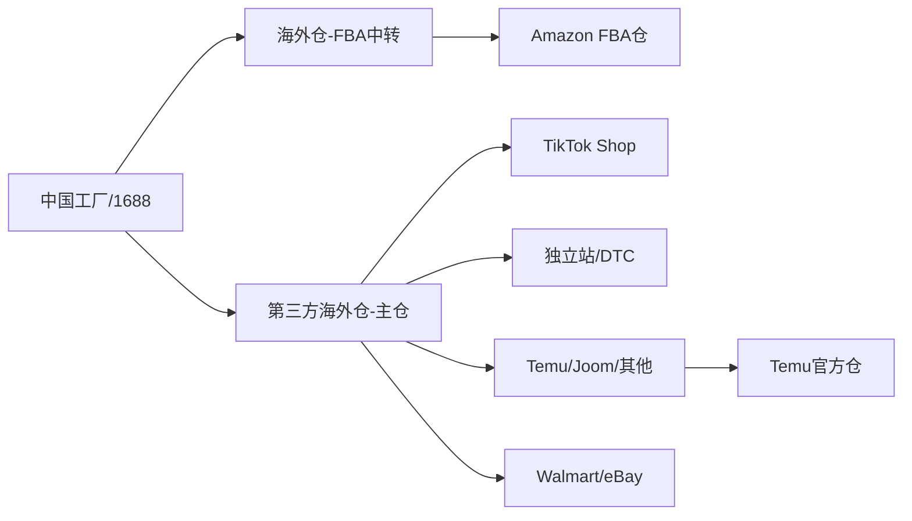

# 跨境供应链全链路实战指南（2026年5月v5.0版）

## 一、核心认知：跨境供应链四大环节

```
1688货源筛选 → 采购与谈判 → 跨境物流头程 → 海外仓/FBA尾程派送
```

打通这四环的效率决定了跨境卖家的利润率和竞争力。

---

## 二、1688源头工厂筛选（第1环）

### 2.1 工厂 vs 贸易商辨别法

| 辨别维度 | 真工厂特征 | 贸易商特征 |
|---------|-----------|-----------|
| 店铺标识 | "实力商家"、"超级工厂"、"深度验厂" | 仅有"诚信通"或无标识 |
| 主营产品 | 专注单一品类，产品线窄而深 | 什么品类都卖，SKU极杂 |
| 地址验证 | 直接询要地址说要去拜访，工厂欢迎 | 各种推诿、找理由不让去 |
| 加工定制 | 有"OEM/ODM"标签，支持改款 | 只卖现货，不支持定制 |
| 历史年限 | 5年+老店，稳定经营 | 新店为主或频繁换名 |

### 2.2 1688搜索筛选黄金参数公式

```
条件组合：
  ✅ 销售件数 > 1000pcs（市场需求验证）
  ✅ 采购单价 < 100元（首批测品风险控制）
  ✅ 复购率 ≥ 20%（产品有粘性）
  ✅ 上架时间 ≤ 365天（非尾货）
  ✅ 商家类型：实力商家/超级工厂（供应链保障）
  ✅ 注册资金：工厂型（非贸易公司）
```

### 2.3 三步验证法

1. **线上初筛**：使用1688跨境专供频道（global.1688.com）+ AI源采工具，筛选支持"一件代发"的供应商
2. **小额试单**：无论沟通多好，先下一个小单测试响应速度、产品质量、包装、发货时效
3. **实地拜访**（可选）：展会（广交会/义乌博览会）+ 产地实地考察

### 2.4 跨境卖家的四类供应商选择策略

| 阶段 | 推荐供应商类型 | 原因 |
|------|--------------|------|
| 测品期（新手） | 支持一件代发的贸易商 | 零库存风险，不需压资金 |
| 起量期 | 专业工厂（实力商家） | 成本降低20-40%，品质可控 |
| 爆单期 | 深度合作的源头工厂 | 产能保障，优先排单 |
| 品牌期 | OEM/ODM工厂联合开款 | 独家产品，核心护城河 |

---

## 三、采购谈判实战（第2环）

### 3.1 六大砍价话术与策略

| 策略 | 话术模板 | 适用场景 |
|------|---------|---------|
| 阶梯报价 | "我首批100个，如果返单1000个，能给什么价？" | 所有场景 |
| 材料成本压价 | "我查了XX原料现在才¥XX/kg，你这个用料最多XXg，材料成本不超过¥XX吧" | 懂成本结构的产品 |
| 付款条件换折扣 | "我接受预付款50%，尾款货到付清，能便宜5个点吗？" | 工厂急需资金周转时 |
| 验厂压力 | "我们下周去义乌，顺道去你厂里看看产线行吗？" | 怀疑是贸易商时 |
| 翻单承诺 | "这个品我们跑起来后月均至少1000单，你给个长期合作价" | 已有一定销量时 |
| 竞品对标 | "XX工厂这个品报价比你低15%，你怎么看？" | 有备选供应商时 |

### 3.2 必须问清楚的5个关键问题

1. **价格含税吗？**（含13%增值税专票 vs 不含税价格差约11.5%）
2. **模具费怎么算？**（开模费能否在返单后退还？）
3. **不良率怎么处理？**（次品是补发还是退款？标准是什么？）
4. **有无CE/FCC/ROHS认证？**（影响通关和平台合规）
5. **发货时效承诺？**（交期违约如何补偿？）

### 3.3 账期与付款策略

| 阶段 | 付款方式 | 说明 |
|------|---------|------|
| 首次合作 | 1688担保交易+支付宝 | 平台担保，资金安全 |
| 多次合作后 | 部分预付款+尾款验收付 | 降低资金占用 |
| 深度合作 | 月结/账期（30-60天） | 需建立信任，适合大卖家 |

---

## 四、跨境物流头程（第3环）

### 4.1 三种运输方式对比

| 运输方式 | 时效 | 成本 | 适合场景 |
|---------|------|------|---------|
| 海运整柜(FCL) | 25-35天 | 最低(¥8-15/kg) | 大货、补货、非紧急 |
| 海运拼箱(LCL) | 25-35天 | 中等(¥15-25/kg) | 中小批量、测款 |
| 空运 | 5-10天 | 高(¥35-60/kg) | 紧急补货、高利润品 |
| 快递(国际小包) | 7-20天 | 中等(¥20-40/kg) | 小件、低客单价 |

### 4.2 FBA头程完整流程

```
国内集货 → 贴标包装(FNSKU) → 送货至货代仓 → 出口报关 
→ 国际海运/空运 → 目的港清关 → 海外仓中转 → 预约送FBA仓
```

### 4.3 选择货代的3个核心指标

1. **资质**：FMC/NVOCC无船承运资质，全年查验率<1%为优
2. **网络**：国内外自营仓点覆盖（华东/华南集货仓 + 美西/美东/美中海外仓）
3. **系统**：自研TMS系统，可实时追踪全链路节点

---

## 五、海外仓履约与尾程（第4环）

### 5.1 三种仓储模式对比

| 模式 | 适用场景 | 优势 | 劣势 |
|------|---------|------|------|
| 亚马逊FBA | 亚马逊平台卖家 | Prime流量权重高 | 仓储费贵，长期库存罚款 |
| 第三方海外仓 | 多平台卖家(独立站/TikTok/Temu) | 灵活、成本低 | 无平台流量加成 |
| FBA+海外仓混合 | 中大规模卖家 | 互补优势 | 管理复杂度高 |

### 5.2 美国海外仓选址策略

| 区域 | 代表城市 | 优势 | 适合品类 |
|------|---------|------|---------|
| 美西 | 洛杉矶、长滩 | 港口近、直发快 | 大件、紧急补货 |
| 美东 | 新泽西、纽约 | 覆盖人口密集区、时效快 | 高周转、时敏品 |
| 美中 | 肯塔基、印第安纳 | 仓储租金低 | 中转运、长期备货 |

### 5.3 海外仓费用构成（以美国小件为例）

| 费用项 | 参考价格 | 说明 |
|-------|---------|------|
| 头程运费 | 占成本30-40% | 海运/空运 |
| 入库费 | $0.2-0.5/件 | 卸货、清点、上架 |
| 仓储费 | $0.6-0.8/立方英尺/月 | 部分有30天免租期 |
| 操作费(拣货打包) | $1.0-1.5/单 | 含贴单、打包 |
| 包装材料费 | $0.3-0.8/单 | 纸箱、气泡袋 |
| 尾程运费 | $4.5-8.0/单 | USPS/UPS/FedEx |
| **一单总成本** | **约$7-12/单** | 不含头程，适合高客单价品 |

### 5.4 库存管理黄金指标

| 指标 | 健康范围 | 说明 |
|------|---------|------|
| 库存周转率 | ≥6次/年（即60天周转一次） | 越高越好 |
| 滞销预警 | 存放>90天 | 必须清仓或促销 |
| 断货预警 | 库存可售天数<30天 | 立即补货 |
| 安全库存 | 覆盖1.5-2个月的销量 | 对抗物流波动 |

### 5.5 补货公式（安全库存法）

```
再订货点 = 日均销量 × 补货周期(天) + 安全库存
安全库存 = 日均销量 × (补货周期 × 1.5 - 补货周期)
```

**示例**：日均销量20单，补货周期30天(海运)
- 安全库存 = 20 × (30×1.5-30) = 20×15 = 300件
- 再订货点 = 20×30 + 300 = 900件
- 库存降到900件时触发补货

---

## 六、供应链全链路选择决策树

```
测品阶段:
  └─ 选1688一件代发模式
     ├─ 平台卖家 → 使用ERP(店小秘/马帮)对接
     └─ 独立站卖家 → 使用Shopify+1688代发插件

起量阶段:
  └─ 判断是否转为备货模式
     ├─ 日均10-20单 → 小批量海运拼箱到海外仓
     ├─ 日均20-50单 → 整柜海运到海外仓+FBA混仓
     └─ 日均50+单 → 与工厂深度合作+多仓布局

成熟阶段:
  └─ 供应链升级
     ├─ 联合开发独家产品
     ├─ 多供应商备选+竞价机制
     └─ 自建/入股海外仓（年GMV>$500万时考虑）
```

---

## 七、常见坑点与避坑指南

| 坑点 | 后果 | 解决方案 |
|------|------|---------|
| 供应商是贸易商当工厂 | 成本高20-40%，无法定制 | 用"拜访验厂法"筛查 |
| 议价时没确认含税 | 退税损失13% | 首次询盘必问含税价/专票 |
| 海外仓只看仓储费 | 被操作费/附加费坑 | 要求提供完整费用明细表 |
| 补货不及时断货 | 排名暴跌，重做成本极高 | 用安全库存公式自动预警 |
| 海运旺季没备货 | 延误1-2个月，错过旺季 | 提前2-3个月备货 |
| 一品一供应商 | 被卡脖子，涨价也没办法 | 保持2-3家备选供应商 |

---

## 八、推荐工具矩阵

| 环节 | 推荐工具 | 用途 |
|------|---------|------|
| 供应商筛选 | 1688跨境专供、店雷达、1688 AI源采 | 找供应商、验厂 |
| ERP管理 | 店小秘、马帮ERP、万里牛 | 订单、采购、库存 |
| 头程物流 | 菜鸟跨境智选、纽酷国际、拓威天海 | 国际运输 |
| 海外仓 | 谷仓海外仓、纵腾集团、4PX | 一件代发 |
| FBA辅助 | 亚马逊SEND/FIST | 合规入仓 |
| 库存分析 | 简道云、Excel动态模型 | 补货计算 |

---

## 九、2026年核心趋势：AI重构供应链全链路

### 9.1 AI在供应链中的四大落地场景

| 场景 | 传统模式 | AI模式 | 效果提升 |
|------|---------|--------|---------|
| **需求预测** | 基于历史平均补货，滞后1-2周 | ML模型纳入促销/天气/社媒热度/宏观事件，实时预测 | 准确率提升10%-30% |
| **智能库存管理** | Excel人肉管理，缺货/积压频发 | AI自动计算动态安全库存，低于阈值自动触发补货预警 | 库存周转提速15%-30% |
| **仓库拣货优化** | 人工路径，效率低下 | AI路径优化+自动化分拣设备+PDA扫码 | 拣货效率提升3-5倍，错发率降至0.2%以下 |
| **智能打包** | 人估手裁，包材浪费大 | AI根据商品体积/重量推荐最优包材尺寸 | 包材成本降低15%-25% |

### 9.2 马士基AI预测系统：供应链从"事后补救"到"事前预判"

- 引入AI预测模型，提前14-30天预警供应链中断风险
- 90%的全球零售商计划未来12-24个月内增加AI物流投资

### 9.3 选品侧AI革命

- **痛点挖掘法**：AI抓取竞品评论→情感聚类→挖掘"我喜欢但是"后面的未被满足需求
- **亚马逊"未满足需求"功能**：分析数十亿次搜索/浏览/加购行为，自动锁定"高搜索、低成交"空白市场
- **1688"遨虾"AI智能体**：市调→选品→找厂→议价→素材→上架，过去熟手100分钟的工作压缩到1-2分钟

### 9.4 头程物流AI化

- **智能路线规划**：AI根据实时运价、港口拥堵、天气数据自动推荐最优航线
- **报关单证自动化**：WCO数据显示AI可将单证审核从20分钟压缩到2分钟
- **关税预估算**：AI根据HS编码自动计算各国关税并纳入到岸成本

### 9.5 智能仓储方向

- **领星WMS（市占率33%行业第一）**：AI驱动智能打包、智能分拣、库内分析，对接40+平台
- **菜鸟机器人仓库**：2026年在香港/美国/欧洲大规模建成，AI调度系统提升存储密度和作业时效
- **磅旗科技**：仓储空间利用率提升40%+，拣选效率最高提升300%，人力成本降低50%

### 9.6 2026年跨境WMS行业数据
- 行业市场规模CAGR：22.6%（2020-2025）→ 预计24.6%（2025-2029）
- WMS可实现：订单处理效率+30%，货物扣关率-40%，库存积压成本-40%
- 行业CR5超64%，头部企业领星WMS市占率33%

## 十、2026年全球供应链重构与政策巨变

### 10.1 全球供应链"长+短"分化趋势

| 趋势 | 表现 | 对卖家的影响 |
|------|------|-------------|
| **区域内短链化** | 近岸外包、友岸外包兴起，北美/欧盟区内供应链密度提升 | 需在目的国或邻国布局海外仓/组装线 |
| **跨区域长链化** | 半导体、新能源车供应链跨多国，环节增加 | 需多源采购、备选供应商 |
| **美国打击"洗产地"** | 301调查覆盖16国，核查资本结构/物料来源/技术依赖 | 单纯转口越南/墨西哥已不够，需"实质性制造" |

### 10.2 2026年主要关税与政策变化

**美国方向：**
- 800美元以下小额豁免取消（5月起）：中国直邮包裹关税30%-120%，或$100-200/件
- 墨西哥2026年1月起加征关税（5%-50%）：针对汽车/钢铁/纺织/塑料/玩具等17个行业
- 亚马逊FBA 2026费用调整：4月17日起加收3.5%燃油附加费；低库存水平费；超180天加收$5.45/立方英尺

**中国方向：**
- 9610全国跨关区退货（4月落地）：退货不再必须回原出口口岸，全国任一合规口岸均可退运
- 退运免税政策（2026-2027）：出口商品6个月内原状退运进境免征进口关税、增值税、消费税
- 商务部"AI+电商"上升为国家战略

**其他市场：**
- 泰国2026年起对所有进口商品征税，包裹税率10%
- 欧盟取消150欧元以下免税，7月起统征关税
- 印尼超100美元包裹强制征税

### 10.3 美国小额豁免取消后的物流模式转型

```
原模式：B2C直邮（空运小包，享受800美元免税）
    ↓
新必选模式：B2B2C（大宗贸易进口至美国海外仓→本地派送）
    ↓
优势：单件成本从空运$4-8降至海运$1-2，关税合规可控
```

### 10.4 供应链重构战略选择矩阵

| 卖家类型 | 应对策略 | 关键动作 |
|---------|---------|---------|
| 铺货型卖家 | 海外仓前置+多平台分散 | 从直邮转型海运+海外仓模式 |
| 品牌型卖家 | 北美/欧洲本地化 | 考虑在墨西哥/波兰设仓或组装 |
| 工厂型卖家 | 产能外移+合规先行 | 东南亚/墨西哥设厂，注意"实质性制造"门槛 |

## 十一、2026年海外仓布局深度指南

### 11.1 海外仓暴雷频发（2026年最新警示）
- 美国洛杉矶长滩港一周内暴雷5家海外仓，波及2000+卖家，查封货值超2亿元
- 暴雷仓典型特征：超低价揽货、运营不满2年、缺乏合规资质

### 11.2 海外仓选仓4步避坑法

**第一步：精准选址**
- 美西：洛杉矶/长滩（港口优势+覆盖西海岸）
- 美东：新泽西/芝加哥（覆盖东北部高消费区）
- 警惕"偏远低价仓"：仓储费低但尾程配送费高、时效难保障

**第二步：全成本核算**
- 必须确认的7项费用：仓储费+入库费+上架费+操作费+尾程费+旺季附加费+包材费
- 避免"只看仓储费"的陷阱，关注全链路综合成本

**第三步：时效与应急能力**
- 考察：24小时发货率≥99%、库存准确率≥99.8%
- 旺季应对方案：是否与多家尾程物流合作（UPS/FedEx/USPS）
- 避坑：2025年有小型仓因合作物流账户被关停，15万件货物滞留超50天

**第四步：系统协同与自动化**
- 必须对接：支持标准API/EDI接口，对接亚马逊/TikTok/Temu及自有ERP
- 自动化设备：是否配备自动化分拣/扫码/出库流水线（轻小件时代标配）
- 全链路可视化：货物到仓/订单处理/尾程轨迹实时追踪

### 11.3 不同规模卖家的海外仓策略

| 卖家规模 | 推荐策略 |
|---------|---------|
| 中小卖家（月销<$50万） | 1个中型品牌仓（平衡成本与保障）+ 平台FBA/FBT |
| 中大型卖家（月销$50-200万） | 主仓+备用仓模式（如美西洛杉矶主仓+美东新泽西备用仓）|
| 头部卖家（月销>$200万） | 多仓布局+深度定制服务+系统自有化 |

### 11.4 2026年标杆海外仓推荐

| 服务商 | 核心优势 | 适合卖家 |
|-------|---------|---------|
| **海智链**（20仓/25万㎡） | 自研WMS系统，24h发货率99.79%，库存准确率100% | 全品类，中大件家具/3C/汽配 |
| **万邑通** | 仓配标准化，中小卖家友好，多店铺统一管理 | 中小卖家的稳定选择 |
| **谷仓互联（纵腾）** | 自动化仓内设备，大件处理能力强 | 中大型企业 |
| **海云汇** | Temu/TikTok官方认证仓，零库存压力代发 | TEMU/TikTok生态商家 |
| **递四方（4PX）** | 菜鸟系，全球仓网布局最广，2026年新开中东/拉美仓 | 多市场卖家 |
| **菜鸟跨境智选** | 官方背书，2026年强化欧洲/美国仓储，与天猫出海深度打通 | 精品卖家/品牌出海 |

### 11.5 2026海外仓暴雷潮全面警示（新增）

**暴雷规模升级（2026年最新）：**
- 美国洛杉矶/长滩港2026年Q1-Q2暴雷海外仓数量同比暴涨300%，波及超5000家跨境卖家
- 头部暴雷案例：国内跨境物流企业"跨境好运"老板卷走2.3亿元跑路，坑惨3.6万卖家
- 另一案例：某深圳货代转移海外仓货物并转卖USPS账号，涉及冻结5100万美元资产
- 合规暴雷：加州某仓因雇佣非法劳工被罚200万+关税申报错误补缴数百万，连锁倒闭

**暴雷仓的5大典型特征：**

| 特征 | 识别方法 | 高危信号 |
|------|---------|---------|
| **超低价揽货** | 价格低于市场均价30%以上 | 仓储费$0.3/立方英尺/月以下，操作费$0.8/单以下 |
| **运营不足2年** | 查询公司注册时间、行业口碑 | 新注册公司、无行业展会/协会活跃记录 |
| **缺乏合规资质** | 要求提供FMC/NVOCC/NFA证书 | 无法出示或推诿"合作方代持" |
| **单一尾程合作商** | 问询合作物流商名单 | 只用一家USPS账号，无UPS/FedEx备选 |
| **现金流紧张信号** | 观察付款周期、员工动态 | 频繁要求提前付款、员工大规模离职 |

**暴雷后的卖家自救策略：**
1. **立即固证**：截取所有聊天记录/合同/付款凭证/物流追踪号
2. **法律维权**：联合受害卖家集体诉讼，分摊律师费
3. **平台报备**：向亚马逊/TikTok/Temu提交被动迁移说明，防止因物流延迟被判定为卖家责任
4. **货物追索**：联系海外仓所在州商业登记部门，查询仓内货物是否已被法院查封
5. **供应链应急预案**：提前备好至少1个备用仓（可在暴雷后48小时切换）

**2026年选仓铁律：先测试后放量，分散布局不押单一**
- 无论服务商承诺多好，首批货物不超过总库存的30%
- 主仓+备用仓模式（不同服务商、不同区域）
- 每月抽查一次库存对账（要求提供WMS后台截图或导出数据）

### 12.1 数据基础设施（第0-30天）
- **单一库存事实源**：打通WMS/OMS/POS/3PL/电商平台数据
- **SKU主数据校验**：条形码、单位、体积、类别、成本价自动校验
- **数据质量红线**：缺失率、重复SKU、库存负数低于0.1%

### 12.2 SKU分层管理（ABC+XYZ法）
- **A类（高周转）**：日级预测+自动补货
- **B类（中等）**：周级预测+人工审核
- **C类（低频/长尾）**：月度审查+最小批量补货

### 12.3 AI补货模型实施路径

```
第0-30天：数据梳理与KPI设定 → 打通数据源，设定库存周转率/缺货率/持有成本基线
第30-90天：试点AI模型 → 选3-5个爆款SKU做ML需求预测，目标：缺货率减10%+
第90-180天：扩展与仓内优化 → 推广至全部A类SKU，上线路径优化，拣货效率提升10%-30%
第180-360天：规模化治理 → 全仓推广，建立持续监控和模型迭代机制
```

### 12.4 补货公式（2026升级版）

```python
# 动态安全库存公式（AI版）
动态安全库存 = 历史安全库存 × (1 + α·波动系数 + β·促销影响系数 + γ·关税风险系数)
# 其中 α, β, γ 由ML模型持续训练得出

# 再订货点
再订货点 = AI预测未来补货周期销量 × (1 + 补货周期不确定性系数) + 动态安全库存

# 批量决策
if SKU类型 == "A类" and 产品生命周期 == "成长期":
    补货批量 = AI预测月销量 × 2（双月备货，海运成本最优）
elif SKU类型 == "C类" or 产品生命周期 == "衰退期":
    补货批量 = 最小起订量（零库存策略）
```

## 十三、2026跨境物流全链路成本对照表

| 项目 | 海运（美西） | 空运 | 快递 |
|------|-------------|------|------|
| 头程时效 | 18-35天 | 5-10天 | 7-20天 |
| 头程成本 | ¥8-15/kg | ¥30-50/kg | ¥20-40/kg |
| 海外仓操作费 | $0.3-0.8/单 | $0.3-0.8/单 | — |
| 海外仓仓储费 | $0.5-1.5/立方英尺/月 | 同左 | — |
| 尾程费（小件） | $3.5-8/单 | 同左 | — |
| **综合成本/单** | **约$7-12** | **约$12-25** | **约$8-18** |
| 适合产品客单价 | >$15 | >$35 | >$20 |

**核心趋势：海运+海外仓模式已成为2026年主流选项，因小额豁免取消后直邮成本飙升。**

# 批量决策
if SKU类型 == \"A类\" and 产品生命周期 == \"成长期\":
    补货批量 = AI预测月销量 × 2（双月备货，海运成本最优）
elif SKU类型 == \"C类\" or 产品生命周期 == \"衰退期\":
    补货批量 = 最小起订量（零库存策略）
```

---

## 十四、多平台库存协同与一仓发全渠道（2026新增）

### 14.1 多平台时代的供应链新挑战

2026年跨境卖家普遍同时运营Amazon、TikTok Shop、Temu、独立站等多个渠道，不同平台的流量波动、促销节奏、退货率差异巨大，传统的"一个平台一套库存"模式导致：
- 库存碎片化：同一SKU在4个平台各备1个月库存，总库存量是实际需求的4倍
- 补货盲区：在一个平台卖爆了，其他平台却在打折清仓
- 死库成本：每个平台的退货品/滞销品分散在多个仓，清理效率极低

### 14.2 三仓合一模式（Amazon FBA + 第三方海外仓 + Temu/TikTok官方仓）



**核心原则：总库存池化，按需分配**

| 渠道 | 库存来源 | 优势 | 劣势 |
|------|---------|------|------|
| Amazon | FBA仓(主) + 海外仓(备) | Prime流量权重，次日达 | FBA仓储费贵，长期死库罚款 |
| TikTok Shop | 第三方海外仓(主) | 灵活控价，可一键切换达人带货 | 时效达不到FBA标准 |
| Temu | 官方仓(主) + 海外仓(备) | Temu流量倾斜 | 价格被压，利润薄 |
| 独立站 | 海外仓(主) | 完全自主定价 | 无自然流量 |

### 14.3 多平台库存分配计算公式

```python
# 2026多平台库存分配模型
总可用库存 = 海外仓库存 + FBA在库量 - FBA预留量 - 已下单未发出量

平台分配比例 = 平台近30天销量占比 × (1 + 促销系数 + 流量系数 + 季节系数)
# 促销系数：大促期间某平台分配上调20-50%
# 流量系数：达人带货/广告增量预估
# 季节系数：历史同期平台销量占比

# 安全阈值
if 某平台库存可售天数 < 15天:
    触发紧急调拨：从总池按比例划拨
    if 总池库存可售天数 < 20天:
        触发补货预警

# 滞销品跨平台转移
if SKU在A平台 > 90天未出:
    降价调拨到B平台或C平台
    # 经验：TikTok清库存效率是Amazon的3倍（短视频爆单效应）
```

### 14.4 2026年ERP选型建议（多平台库存管理）

| ERP系统 | 多平台对接能力 | 适合卖家类型 | 2026年亮点 |
|---------|-------------|-------------|-----------|
| **领星ERP** | Amazon+TikTok+Temu+独立站，40+平台 | 中大卖 | WMS市占率33%行业第一，AI智能补货、智能打包 |
| **马帮ERP** | 50+平台对接，1688采购直连 | 全阶段卖家 | AI采购预测+多仓库存协同 |
| **店小秘** | 30+平台，低价位入门 | 中小卖家 | 轻量化，上线快 |
| **万里牛** | 20+平台，跨境+国内双赛道 | 多品类卖家 | 智能分仓策略，自动匹配最优发货仓 |

### 14.5 一仓发全渠道实操SOP

```
Step 1：统一SKU编码
  ✅ 所有平台同一产品使用统一SKU ID
  ✅ 在WMS中建立SKU-平台映射表（如 SKU-A-AMZ, SKU-A-TTK）

Step 2：库存数据实时同步
  ✅ 开启ERP库存自动同步功能（防超卖）
  ✅ FBA库存设置30分钟同步一次
  ✅ 第三方海外仓库存设置15分钟同步一次

Step 3：智能路由发货
  ✅ 消费者下单 → ERP判断最优发货仓
  ✅ 优先级：FBA有货且Prime → FBA；海外仓近消费者仓 → 第三方；Temu订单 → Temu官方仓
  ✅ 如果Prime断货，自动切到海外仓发（时效差1-2天但保转化）

Step 4：滞销品主动干预
  ✅ 设置自动规则：库龄>60天→降价预警→平台间降价调拨→加入TikTok清货计划
  ✅ 跨平台调拨：每季度一次库存复盘
```

---

## 十五、2026绿色供应链与ESG合规（新增）

### 15.1 欧盟碳边境税(CBAM)对跨境卖家的影响

| 时间节点 | 政策要点 | 对卖家影响 |
|---------|---------|-----------|
| 2026年1月起 | CBAM正式征收，涵盖钢铁、铝、水泥、化肥、电力、氢 | 涉及建材/五金/家电品类需报告碳排放数据 |
| 2027年起 | 范围扩大到下游成品（塑料、纺织品、化学品等） | 大量跨境品类将被覆盖 |
| 2028年起 | 碳关税全面实施，无碳报告产品面临惩罚性关税 | 碳排放管理成为准入门槛 |

### 15.2 供应链碳合规实操指南

**包装碳减排（低本高效）：**
- 替换为可回收/可降解包装材料（减碳20-30%）
- 使用AI智能打包减少包材浪费15-25%
- 采用光伏发电和智能温控系统的海外仓，降低能耗30%

**物流碳减排：**
- 选择有绿色物流认证的货代/海外仓
- 海运方式(碳排最低)优先于空运
- 与海外仓协商使用电动配送车辆

**2030年关键目标：**
- 欧盟要求所有进口商品附带碳足迹标签
- 亚马逊"气候友好承诺"计划覆盖面扩大到所有品类
- 建议：2026年开始建立碳数据收集体系，为2030年做准备

### 15.3 ESG对供应链金融的影响

- 2026年起，多家银行将ESG评分纳入跨境供应链贷款利率
- 绿色供应链认证企业可享受利率优惠0.5-1%
- 碳排放超标的供应商可能被金融机构列入"高污染"名单，融资受限

---

## 十六、跨境供应链金融与汇率管理（新增）

### 16.1 2026年利率汇率环境对供应链的影响

| 因素 | 趋势 | 供应链策略 |
|------|------|-----------|
| 人民币兑美元 | 2026年双向波动加大，贬值压力持续 | 锁汇工具+多币种结算组合 |
| 美联储利率 | 暂停降息，利率高位维持 | 美元融资成本高，优先人民币融资 |
| 海运价格 | 2026年运价波动加剧，Q2-Q3旺季可能暴涨 | 锁定长协价+弹性运力备选 |

### 16.2 供应链金融三大工具

| 工具 | 运作方式 | 适合卖家 | 成本 |
|------|---------|---------|------|
| **跨境应收账款保理** | 凭平台订单/发货单提前回款 | 月销$5万+卖家 | 年化6-12% |
| **库存质押融资** | 以海外仓库存为抵押融资 | 库存金额$10万+ | 年化8-15% |
| **信用证/远期信用证** | 工厂发货后银行担保付款 | 工厂型/品牌卖家 | 手续费0.5-2% |

### 16.3 汇率避险实操三板斧

1. **远期锁汇**：做3-6个月远期购汇，锁定汇率成本（建议占比50-70%）
2. **多币种收款账户**：同时持有美元/欧元/英镑收款账户，选择汇率最优时结汇
3. **跨境收款平台对冲**：使用万里汇/Payoneer的"汇率锁"功能，大额回款前锁定汇率

### 16.4 2026年供应链资金流黄金公式

```
净现金流 = 回款速度 - 采购付款速度 - 物流垫付速度

健康标准：
- 回款周期 < 30天（平台账期正常）
- 采购付款周期 > 60天（工厂垫资/账期）
- 物流垫付 < 15天（货代账期）
- 现金转化周期 < 45天（理想状态）
```

---

## 十七、供应链风险管理升级（2026新增）

### 17.1 2026年供应链五大黑天鹅风险

| 风险类型 | 概率 | 影响程度 | 应对策略 |
|---------|------|---------|---------|
| **美国加征对等关税** | 高 | 高 | 海外仓前置+多国采购分散 |
| **海运运力突然紧张** | 中高 | 中高 | 长协价锁定+空运紧急备选 |
| **海外仓暴雷/关停** | 中 | 高 | 主仓+备用仓+分散布局 |
| **人民币大幅升值** | 中 | 中 | 远期锁汇+多币种结算 |
| **产地国政治动荡** | 低中 | 高 | 产地多元化+3-6个月安全库存 |

### 17.2 供应链弹性评估模型

```python
# 供应链弹性Score
弹性评分 = (供应商多样性得分 × 0.3) + (仓储分散度得分 × 0.25) + 
           (物流备选方案数 × 0.2) + (库存缓冲系数 × 0.15) + 
           (数字化程度 × 0.1)

# 评分标准：0-100分
# >80分：稳健；60-80分：需优化；<60分：高危
```

### 17.3 2026年供应链灾备预案模板

```
【美国加关税场景】：
  触发条件：美国宣布对中国商品加征≥10%关税
  行动： 
    1. 48小时内评估受冲击SKU清单
    2. 向海外仓紧急调货（赶在关税生效前入仓）
    3. 通过TikTok/Temu等非美渠道分流库存
    4. 重新计算到岸成本，调整定价策略

【海外仓暴雷场景】：
  触发条件：海外仓出现任何负面信号（延迟发货、海外仓联系不上）
  行动：
    1. 立即停止向该仓发货
    2. 联系备用仓48小时内切换
    3. 向平台提交不可抗力说明
    4. 法律团队介入追讨货物

【海运中断场景】：
  触发条件：红海/巴拿马运河等关键航道中断
  行动：
    1. 紧急切换空运+快递组合（成本上升但保供）
    2. 启动安全库存消耗
    3. 优先保障高利润SKU的订单履约
```

---

## 十八、跨境供应链AI Agent实战指南（2026新增核心章节）

### 18.1 2026年供应链AI Agent的形态革命

传统ERP/WMS是"人操作工具"的模式，2026年的供应链Agent是"Agent替代人执行"的模式。

| 环节 | 传统模式 | AI Agent模式 |
|------|---------|-------------|
| **供应商寻源** | 人工1688搜索+比价+沟通 | AI Agent自动识别工厂、获取报价、横向比价、生成推荐排行 |
| **采购下单** | 人工核对库存→下订单→跟进 | Agent监测库存阈值自动下单、自动议价、异常预警 |
| **物流调度** | 人盯运价→比价→订舱 | Agent实时监控运价波动、自动切换最优路线、订舱 |
| **库存补货** | Excel/ERP人工算→手动调单 | Agent执行AI预测模型→自动触发补货→多仓智能调拨 |
| **报关清关** | 人工填单→申核→申报 | Agent自动识别HS编码→生成报关单→AI预审→直连海关系统 |
| **异常处理** | 人工发现→追查→解决 | Agent7×24监控全链路异常→自动诊断→触发应对预案 |

### 18.2 AI Agent在跨境供应链中的5个高ROI落地场景

**场景1：智能选品+供应商匹配 Agent**
- 输入：1688搜索关键词 + 目标利润空间 + 合规要求
- 动作：Agent自动爬取1688→筛选工厂→验证资质→模拟到岸成本→产出Top10供应商推荐
- 效率提升：100分钟工作量 → 1-2分钟
- 工具：1688"遨虾"AI智能体、店雷达AI、1688 AI源采

**场景2：智能补货 Agent**
- 输入：各平台实时销售数据 + 在途库存 + 物流周期 + 关税变动
- 动作：AI预测→计算动态安全库存→触发补货→多平台库存分配
- 效果：缺货率降低30%+，库存周转提速20%
- 工具：领星ERP AI补货模块、马帮AI采购预测

**场景3：物流比价+智能调度 Agent**
- 输入：货物品类+体积+重量+目的地+时效要求
- 动作：实时抓取多家货代报价→AI对比→推荐最优路线/价格
- 效果：物流成本优化10-20%
- 工具：菜鸟跨境智选、纽酷国际AI比价、ShipBob AI路由

**场景4：合规+报关 Agent**
- 输入：产品品类+材质+HS编码候选
- 动作：AI匹配最优HS编码→各国关税预估算→合规风险扫描→生成报关单
- 效果：报关时间从20分钟压缩到2分钟，扣关率降低40%
- 工具：各类AI报关SaaS平台

**场景5：供应链全链路数字孪生 Agent**
- 输入：全链路实时数据（采购→生产→物流→仓储→末端配送）
- 动作：构建数字孪生模型→模拟"假设"场景→提前预警中断风险
- 效果：提前14-30天预警供应链中断
- 典型：马士基AI预测系统

### 18.3 1688 AI智能体"遨虾"实测指南

**核心能力矩阵：**
1. 市调：输入品类关键词→自动生成市场容量/竞争格局/价格带分布
2. 选品：基于市场热度+利润空间+竞争烈度→推荐蓝海SKU
3. 找厂：根据选品需求→自动匹配"实力商家/超级工厂"→按资质排序
4. 议价：AI批量联系多家工厂→获取最优报价
5. 素材：产品图AI精修→多语言描述生成→一键铺货

**使用建议：**
- 适合环节：测品期和起量期的供应商匹配
- 不适合：大货和OEM/ODM定制需求（仍需人工深度沟通）
- 成本：1688平台免费使用（2026年5月）

### 18.4 MCP协议与供应链数据互通（2026最新）

MCP（Model Context Protocol）协议的普及正在改变跨境供应链的数据互通模式：

- MCP标准下，WMS/ERP/TMS可以统一暴露标准化API接口供AI Agent调用
- 未来趋势：一个AI Agent可以同时对接1688供应商数据+货代系统+海外仓WMS+平台销售端
- 选型建议：2026年采购ERP/WMS时，优先选择支持MCP协议的系统

---

## 二十、2026年5月v5.0第七轮深化更新：供应链基础设施化与品牌化新时代

### 20.1 亚马逊ASCS全面开放：供应链基础设施化的里程碑（2026年5月4日）

**事件**：2026年5月4日，亚马逊宣布推出Amazon Supply Chain Services（ASCS），首次将自建的全球物流网络向**所有类型和规模的企业**开放——不仅限于亚马逊平台卖家，也包括独立站、多平台卖家、甚至非电商企业。

**ASCS核心服务内容**：
| 服务模块 | 原服务名 | 开放范围 | 说明 |
|---------|---------|---------|------|
| 头程运输 | AGL/Amazon SEND | 对所有企业开放 | 从制造端提货到目的港，支持海运/空运 |
| 仓储与分销 | FBA仓储网络 | 对所有企业开放 | 可使用亚马逊全球仓储网络 |
| 末端配送 | FBA配送 | 对所有企业开放 | 2-5天配送时效承诺 |
| 增值服务 | 库存预测、多渠道履约 | 对所有企业开放 | AI库存预测、智能调拨 |

**首批签约企业**：宝洁、3M、Lands' End、American Eagle Outfitters等全球品牌。

**对跨境卖家的深远影响**：

| 影响维度 | 具体变化 | 卖家应对 |
|---------|---------|---------|
| **非亚马逊卖家** | 独立站/TikTok/其他平台可接入亚马逊物流网络 | FBA时效覆盖全渠道，独立站次日达不再遥不可及 |
| **中小卖家** | 无需自建物流体系，按使用付费 | 供应链成本从固定成本转为可变成本 |
| **成本结构** | ASCS价格体系公开透明，直追UPS/FedEx | 大件/重货配送有了新的低价选项 |
| **竞争格局** | 亚马逊成为「物流平台」而非「电商平台」 | 亚马逊的意义从流量入口转向基础设施 |

**核心判断**：ASCS标志着跨境电商供应链从「支撑环节」升级为「独立可交易的商品」。卖家不再是供应链的管理者，而是供应链服务的购买者——这是「供应链即服务」（SCaaS）时代正式到来的标志。

### 20.2 「告别9.9包邮」：品牌化供应链新时代（2026年5月新京报深度）

**核心观点**：全球各国跨境电商监管政策持续收紧，免税红利加速退潮，低价铺货模式的合规成本持续攀升。中国电商出海正式告别「野蛮生长」，进入品牌化、差异化、精细化运营新周期。

**2026年5月品牌化供应链关键事件**：

| 平台/企业 | 品牌化动作 | 对供应链的影响 |
|----------|-----------|--------------|
| **Temu** | 「新拼姆」计划：3年1000亿元孵化自营品牌 | 从白牌采购转向产业带品牌化生产，供应链要求从「最低价」转向「品质+价格」 |
| **速卖通** | 2026年帮助2000个中国品牌出海规模翻倍 | 品牌GMV增长40%，品牌商对供应链要求更高（合规、时效、包装） |
| **京东Joybuy** | 欧洲6国落地，22亿欧元收购Ceconomy 85.2%股份 | 重资产供应链模式：60+自营海外仓+1000+线下门店，欧洲30城「211限时达」 |
| **小红书Redshop** | 6月上线，首期50家种子商家，聚焦非遗手作 | 文化出海的供应链需求：小批量、高客单价、定制化包装 |
| **TikTok Shop** | 美区年度大会明确「兴趣电商」取代低价内卷 | 供应链需支撑达人带货的爆发性需求（48小时紧急补货能力） |

**供应链核心转变**：
```
低价供应链（2019-2025）         品牌化供应链（2026+）
┌──────────────────────┐   →   ┌──────────────────────┐
│ 最低成本             │       │ 品质+成本平衡        │
│ 大批量标准化         │       │ 小单快反+差异化      │
│ 合规模糊             │       │ 全链路合规透明        │
│ 时效容忍（7-30天）   │       │ 时效承诺（2-7天）     │
│ 包装简陋             │       │ 品牌化包装            │
│ 多平台铺货           │       │ 品牌阵地+多平台分销   │
└──────────────────────┘       └──────────────────────┘
```

### 20.3 货代暴雷潮终极洗牌：深圳税务严查+恶性竞争终结（2026年5月）

**行业数据更新（v5.0版）**：
- 2025年全年：三大口岸曝光失信货代超过**1100家**
- 2025年全年：海外仓暴雷事件超**30起**，波及超**4万家**中国卖家，涉案金额超**10亿元**
- **2026年Q1：仅美国市场30多家货代/海外仓暴雷，波及2000+卖家，涉案超2亿元**
- 深圳、广州、义乌：平均每月**5-8家**中小货代注销或跑路
- 暴雷特征：从「偶发」变「集中化、规模化、连环化」

**货代行业毛利率断崖**：
| 年份 | 毛利率 | 核心变化 |
|------|-------|---------|
| 2019年 | 20-30% | 信息差利润丰厚 |
| 2023年 | 10-15% | 数字化船司直营 |
| 2025年 | 5-8% | 价格战白热化 |
| **2026年** | **3-5%** | **跌破盈亏线，系统性危机** |

**深圳税务严查（2026年清明后）**：
- 深圳爆发史上最严货代税务专项核查
- 核心规则：
  - ✅ 纯国际货代服务可免税
  - ✅ 报关、仓储、装卸、国内运输等物流辅助服务**必须按6%缴税**
  - ✅ **严禁打包开具免税发票**
  - ✅ 所有收支**必须公对公结算**
  - ✅ 免税与应税业务**必须分开核算**，否则全额征税
- 后果：一家中型货代补缴金额可达**数百万元**，直接耗尽全年利润
- 中小货代在合规压力下**批量倒闭已成定局**

**2026年卖家选货代终极准则**：
1. ❌ 拒绝任何「低于市场均价30%」的报价——必然通过隐性收费/违规操作弥补
2. ✅ 优先选择**自营海外仓+自营清关团队**的全链路型货代
3. ✅ 要求提供**FMC/NVOCC资质**和**海关备案证明**
4. ✅ 核查**公司运营年限**（低于2年直接排除）
5. ✅ 每月**对账+实物盘点**，不要完全信任系统数据
6. ✅ 至少保持**2-3个备选货代**，不押注单一物流商
7. ✅ 与货代签订正规合同，明确**违约赔偿条款**

### 20.4 TikTok Shop供应链新规密集落地（2026年5月）

| 政策 | 生效时间 | 核心内容 | 供应链影响 |
|------|---------|---------|-----------|
| **美区退货运费调整** | 2026年6月 | 因买家个人原因退货（「不再需要」「尺码不合适」），运费**全额由卖家承担** | 退货成本飙升，低价品利润率被蚕食 |
| **美区自发货关停** | 2026年3月31日已执行 | 所有跨境卖家须通过**官方物流或认证海外仓**履约 | 无海外仓备货的卖家被清退 |
| **东南亚飞轮计划Q2** | 2026年Q2 | 链路优化、成本降低、物流打通、阶段激励 | 平台推动本地仓发货，降低物流成本 |
| **欧洲新站点** | 2026年6月1日 | 波兰、荷兰、比利时站正式上线 | 欧洲仓布局需求增加 |
| **东南亚售后考核** | 2026年7月 | 用**售后处理时长AHT**替代投诉率 | 仓配时效直接影响店铺评分 |

**TikTok Shop供应链适配建议（2026年5月升级版）**：
- 美区**必须有认证海外仓**库存，海运+海外仓成为唯一合规路径
- 达人带货爆发性极强：主仓设在洛杉矶/新泽西，满足48小时紧急补货
- 退货成本核算公式：退货率 × 单件退货物流费($) = 每单隐性成本
  - 当退货率>15%时，低价品（<$20）在TikTok美区基本不赚钱
- 欧洲新站点供应链前置：建议在波兰或德国设仓覆盖全欧洲

### 20.5 2026年5月「红海」海运运费暴涨

**最新运价数据**：
| 航线 | 4月运价 | 5月运价 | 涨幅 |
|------|---------|---------|------|
| 美西(上海→洛杉矶) | $3,800/40尺柜 | $5,200-7,200/40尺柜 | +37-89% |
| 美东(上海→纽约) | $4,200/40尺柜 | $6,100-7,000/40尺柜 | +45-67% |
| 欧洲(上海→汉堡) | $3,500/40尺柜 | $4,800-5,500/40尺柜 | +37-57% |

**涨价原因**：
1. 马士基、达飞、MSC 5月同步上调FAK与燃油附加费
2. 地缘冲突持续导致绕行好望角，运力供给减少
3. 旺季提前（Prime Day备货），需求集中释放
4. USPS自4月26日起加收8%燃油附加费

**卖家应对策略**：
- Prime Day备货：**立即锁仓锁运价**，不要等旺季再订船
- FBM自发货：优先换渠道，USPS+8%燃油费很伤利润
- 空运备选：高利润品可考虑空运+快递组合（成本高但保时效）
- 长协价锁定：月出货量>50柜的卖家，立即与船公司/货代签季度长协

### 20.6 合规供应链新规倒计时（2026年5月13日）

| 法规 | 截止日期 | 核心要求 | 涉及品类 |
|------|---------|---------|---------|
| **欧盟包装新规** | 2026年8月12日强制 | 电商包裹**内部空隙≤50%**，缓冲材料计入空隙 | 所有电商发货 |
| **CPSC eFiling** | 2026年7月8日 | 部分消费品须海关电子申报CPSC证书 | 儿童产品、玩具、电子电器 |
| **欧盟CBAM数据核算** | 2026年5月起 | 从「申报期」进入「数据核算期」 | 钢铁/铝/水泥/化肥/电力/氢 |
| **美国版权TRO风暴** | 持续升级 | 艺术家Susan A. Winget起诉，200+卖家被下架冻结 | 餐具/家纺/地毯/装饰画/服装 |

**欧盟包装新规实操清单**：
1. 检查包装箱：商品与箱壁之间的空隙比例
2. 使用**预成型内衬**（固定商品位置，减少空隙）
3. 避免「过度包装」——大箱装小物会直接违规
4. 可回收/可降解包装材料成为刚需
5. 建议：5月完成包装方案测试，6月所有新发货改用合规包装

### 20.7 中国跨境贸易便利化重大利好（2026年5月）

| 政策 | 内容 | 供应链直接利好 |
|------|------|--------------|
| **9610全国跨关区退货**（4月1日起） | 跨境电商零售出口退货可跨关区退回，不必回原出口海关 | 退货逆向物流成本降低50%以上 |
| **退运免税政策延续**（2026-2027） | 出口商品6个月内原状退运进境免征进口关税/增值税/消费税 | 退货不再成为「不可能承受之成本」 |
| **商务部六部门电商高质量发展新规** | 大力支持海外仓、完善海外智慧物流平台、鼓励海外建设直采基地 | 政策层面为海外仓扩容铺路 |
| **24部门跨境贸易便利化专项行动** | 45城落地，优化通关、降低合规成本 | 出口清关效率提升 |
| **重庆跨境电商政策汇总**（7条） | 海关+平台+海外合规全解析 | 地方配套政策加速供应链本地化 |

**逆向供应链（退货管理）实战SOP**：
```
Step 1：退货接收
  ✅ 海外仓接收退货商品→检查外观完整性
  ✅ 分类：可重新销售的→返架；需维修的→维修区；报废的→销毁/回收

Step 2：退货处理
  ✅ 可再售商品：清洁→更换包装→重新上架
  ✅ 不可再售品：通过TikTok清货计划低价处理（清库存效率是Amazon 3倍）
  ✅ 跨境退货：通过9610跨关区退货政策退回国内（可灵活选择最近的合规口岸）

Step 3：成本核算
  ✅ 每单退货总成本 = 退货运费 + 处理费 + 再包装费（或报废损失）
  ✅ 退货率超过20%的SKU→评估是否应停止销售
```

### 20.8 Shopee供应链成本暴增（2026年5月最新）

| 平台 | 费用调整 | 生效时间 | 对供应链影响 |
|------|---------|---------|-------------|
| Shopee泰国 | Marketplace佣金从1.09%→3.27%，涨幅**200%** | 6月1日 | 本土店利润被大幅压缩 |
| Shopee越南 | 交易处理费从4.91%→6% | 5月21日 | 每单成本+1.09% |
| Shopee各站 | 预售服务费上调 | 5月21日 | 预售模式成本飙升 |
| eBay | 议价规则改为「先付款先得」 | 已生效 | 多买家议价时谁先付款卖给谁 |

**对供应链的连锁反应**：
- 平台佣金暴涨 → 卖家必须提升客单价 → 要求供应链从「低价」转向「品质」
- 预售模式成本升高 → 推动卖家从「预售测款」转向「现货备货」
- 泰国佣金200%涨幅 → 东部/南亚仓配成本优势减弱，供应链重心可能调整

### 20.9 2026年5月全球供应链金融新局面

| 趋势 | 具体变化 | 对卖家影响 |
|------|---------|-----------|
| **六部门新规** | 鼓励银行基于订单流/物流/资金流数据，为跨境电商/海外仓提供金融服务 | 应收账款融资产品丰富 |
| **货代暴雷连锁反应** | 金融机构收紧对货代/海外仓的信贷 | 货代融资难→服务不稳定 |
| **汇率风险加剧** | 人民币双向波动加大，特朗普访华关税变量带来不确定性 | 锁汇成本上升 |
| **海外仓质押融资兴起** | 「海外仓质押+汇率避险」成为新金融组合拳 | 库存可抵押变现，资金压力缓解 |

**2026年5月汇率避险操作指南**：
- **远期锁汇**：3-6个月远期购汇，建议锁50-70%头寸
- **多币种收款账户**：同时持有美元/欧元/英镑，择机结汇
- **外汇期权组合**：买入看跌期权保护下行风险，卖出看涨期权降低保费成本
- **关键窗口**：特朗普5月13-15日访华前后，汇率波动极大，建议提前锁汇

### 20.10 「一人公司」超级个体供应链模型（2026年新趋势）

**背景**：品牌化时代不再只有大卖才能做品牌。AI Agent工具链的成熟，让超级个体（一人公司）也能搭建完整的品牌供应链。

**一人公司供应链配置（月成本模型）**：

| 环节 | 工具/服务 | 月成本($) | 说明 |
|------|----------|----------|------|
| 工厂寻源 | 1688遨虾AI智能体 | 免费 | AI自动匹配工厂、比价、资质验证 |
| 仓储履约 | ASCS/谷仓互联/万邑通 | $200-500起 | 按使用量付费，无最低承诺 |
| 库存管理 | 领星WMS/店小秘 | $30-100 | AI补货预警+多平台库存协同 |
| 物流调度 | 菜鸟跨境智选/纽酷AI比价 | 免费+按单 | AI自动比价、推荐最优路线 |
| 合规申报 | AI报关SaaS | $50-200 | HS编码自动识别+电子申报 |
| **总计** | | **$280-800/月** | **一人可启动品牌化供应链** |

**超级个体供应链的3条铁律**：
1. **零固定成本**：不租仓、不囤货、不签长期合同（全部按使用量付费）
2. **全链路数字化**：ERP/WMS/跨境物流平台全部云端化，手机可管理
3. **AI驱动决策**：选品、补货、调价、物流全部由AI Agent自动执行

### 20.11 SCOR-DS数字供应链参考模型（2026年最新实践）

SCOR（Supply Chain Operations Reference）模型演进到SCOR-DS（Digital Supply Chain）版本，是理解2026年供应链最佳实践的底层框架。

**SCOR-DS六大流程**（vs传统SCOR四大流程）：

| 流程 | 传统含义 | SCOR-DS扩展（2026） |
|------|---------|-------------------|
| **Plan** | 计划 | + AI需求预测 + 实时数据驱动 + 弹性规划 |
| **Source** | 采购 | + AI智能寻源 + 供应商数字评分 + 区块链溯源 |
| **Make** | 制造 | + C2M柔性生产 + 数字孪生模拟 + AI质量检测 |
| **Deliver** | 交付 | + 智能路由 + 实时追踪 + 最后一公里AI优化 |
| **Return** | 退货 | + 逆向物流AI优化 + 退货预测 + 再制造闭环 |
| **Enable** | 赋能 | + AI/自动化 + 数字孪生 + 协同平台 + 安全管理 |

**SCOR-DS思维在跨境供应链中的应用（2026年卖家用）**：

```python
# SCOR-DS启发下的跨境供应链优化清单
评估维度：
  1. Plan（计划）：是否用AI预测替代了「拍脑袋补货」？
  2. Source（采购）：是否用AI比价替代了「固定供应商」？
  3. Make（制造）：是否支持「小单快反」而非「大批量生产」？
  4. Deliver（交付）：是否有多条物流路线备选而非「一条路走到黑」？
  5. Return（退货）：退货流程是否数字化、可追踪？
  6. Enable（赋能）：是否用AI/自动化工具替代了70%以上的人工操作？
```

### 20.12 2026年5月供应链十大行动清单（v5.0升级版）

| 序号 | 行动项 | 紧急程度 | 执行周期 | v5.0新增要点 |
|------|-------|---------|---------|-------------|
| 1 | **接入ASCS/对标ASCS**（供应链基础设施化） | 🔴 紧急 | 30天 | 亚马逊ASCS已向全行业开放，评估接入方案 |
| 2 | **品牌化供应链升级**（从白牌到品牌） | 🔴 紧急 | 90天 | 告别9.9包邮，包装/合规/品质全面升级 |
| 3 | **货代优选+合规审查**（避开暴雷潮） | 🔴 紧急 | 14天 | 深圳税务严查+货代毛利率3-5%，选货代只看稳定不看价格 |
| 4 | **TikTok Shop供应链适配**（退货运费卖家全额承担） | 🔴 紧急 | 30天 | 6月新规前完成退货成本核算，调整低价品策略 |
| 5 | **欧盟包装新规合规**（8月12日截止） | 🔴 紧急 | 30天 | 检查包装空隙率≤50%，测试合规包装方案 |
| 6 | **海运运价锁定**（Prime Day备货窗口） | 🔴 紧急 | 7天 | 立即锁仓锁价，旺季前完成备货 |
| 7 | **9610跨关区退货流程对接** | 🟡 重要 | 30天 | 成本降低50%，逆向物流效率大幅提升 |
| 8 | **一人公司超级个体供应链搭建** | 🟡 重要 | 60天 | AI工具链+零固定成本模式，轻装上阵 |
| 9 | **汇率避险+关税对冲**（特朗普访华变量） | 🟢 长期 | 30天 | 5月13-15日窗口期提前锁汇 |
| 10 | **SCOR-DS全链路健康检查** | 🟢 推荐 | 90天 | 用SCOR-DS六大流程逐项诊断供应链短板 |

### 20.1 美国800美元豁免取消正式落地（2026年5月最新）

**执行时间线**：
- 2026年2月：特朗普签署行政令，对中国商品加征10%关税并取消800美元以下小额豁免
- 2026年5月2日：取消800美元"小额豁免"政策（T86清关模式）**正式全面执行**
- 2026年7月8日起：美国CPSC证书必须电子申报（eFiling），覆盖部分消费品

**对供应链的直接冲击**：
| 影响维度 | 具体变化 | 供应链应对 |
|---------|---------|-----------|
| 直邮小包成本 | 综合成本飙升30-120%（关税30%-120%或$100-200/件） | 全面转向海运+海外仓B2B2C模式 |
| 铺货型卖家 | 无海外仓备货的卖家被迫退出市场 | 必须建立海外仓库存体系 |
| 空运小包专线 | 订单量断崖式下滑，部分专线关闭 | 转向海运拼箱+海外仓组合 |
| 清关模式 | T86清关终止，必须走正式报关 | 需HS编码预审+合规报关代理 |

**转型加速器**：此前已在v3.0中预测的"B2C直邮→B2B2C海外仓"转型，从"建议项"变为"生存项"，未完成转型的卖家将在60天内被市场淘汰。

### 20.2 货代/海外仓暴雷潮升级（2026年Q1数据）

**最新数据**：
- 2025年：三大口岸曝光失信货代超过1100家
- **2026年Q1：仅美国市场就有30多家货代/海外仓暴雷，波及2000多名卖家，涉案货值超2亿元**
- 深圳、广州、义乌等物流重镇，平均每月5-8家中小货代注销或跑路

**暴雷升级特征**：
1. **暴雷密度增大**：从"偶发"变为"常态"，Q1暴雷数量同比暴涨300%
2. **大案频出**：头部物流企业"跨境好运"老板卷走2.3亿元跑路，坑惨3.6万卖家
3. **连锁反应**：一家暴雷牵扯多条供应链断裂——被暴雷仓扣押的货物导致卖家在TikTok/Amazon同时断货

**避坑升级策略**（v4.0补充）：
- ✅ **三三原则**：货物分3个仓存放，单仓不超过总库存的1/3
- ✅ **月查制度**：每月至少一次向海外仓索取WMS库存对账截图
- ✅ **物流成本红线**：低于市场均价30%的仓直接拉黑，不贪便宜
- ✅ **备用仓就绪**：提前完成备用仓的合同签署+系统对接，实现48小时切换

### 20.3 阿里1688"遨虾"AI智能体实战指南（2026年最新）

**产品定位**：全球首个跨境电商AI智能体（海外品牌名AlphaShop），已在alphashop.cn限时免费开放

**核心能力矩阵（实测版）**：

| 功能模块 | 输入方式 | 输出内容 | 效率提升 |
|---------|---------|---------|---------|
| **市场调研** | 产品图片/品类关键词/商品链接 | 市场容量分析、竞争格局、价格带分布 | 30分钟→1分钟 |
| **智能选品** | 目标市场+利润空间要求 | 蓝海SKU推荐+市场热度+竞争烈度评分 | 60分钟→2分钟 |
| **工厂匹配** | 选品结果 | 按资质排序的Top10供应商推荐+资质验证 | 100分钟→2分钟 |
| **智能议价** | 产品规格+目标价格 | AI批量联系多家工厂，获取最优报价 | 120分钟→3分钟 |
| **素材生成** | 产品图 | AI精修+多语言描述生成+一键铺货素材包 | 45分钟→5分钟 |

**使用铁律**：
- ✅ 适合：测品期和起量期的供应商初步匹配
- ❌ 不适合：大货和OEM/ODM定制需求（仍需人工深度沟通验证）
- ⚠️ 注意：AI输出的供应商推荐仍需用小额试单+验厂两步验证法核实
- 💰 成本：2026年5月限时免费

### 20.4 各平台供应链新要求（2026年5月）

**Temu半托管Y2模式（2026年新架构）**：
- 新模式："半托国内直发"——卖家备货在国内仓库，Temu平台负责前端销售和流量
- 优势：零海外仓风险，适合测品期卖家
- 劣势：时效比海外仓慢（7-15天），转化率低
- **实操攻略**：TEMU官方培训已推出"半托管Y2模式国内自发货全流程攻略"
- **供应链适配**：需与国内仓+快递国际专线配合，单件物流成本约¥20-40

**TikTok Shop供应链适配**：
- 2026年美区达人带货占70%交易量，供应链需支持"小单快反"
- 达人带货爆发性高、波动大——要求供应链具备48小时紧急补货能力
- **推荐方案**：主仓设在洛杉矶/新泽西（快反仓），FBA作为稳定库存补充

**亚马逊FBA 2026费用变化**：
- 4月17日起加收3.5%燃油附加费
- 低库存水平费持续执行（库存<30天可售天数触发额外费用）
- 超180天库存加收$5.45/立方英尺
- **影响**：FBA仓储成本持续上升，推动卖家采用FBA+第三方海外仓混合模式

**亚马逊CPSC eFiling（2026年7月8日强制）**：
- 部分消费品须在海关电子申报CPSC证书
- 涉及品类：儿童产品、玩具、电子电器等
- **供应链影响**：需提前与工厂确认CPSC证书有效性，否则货物将在海关被扣

### 20.5 2026年选品与供应链联动趋势

**AI玩具爆发**（2026年Q2最大选品热点）：
- 亚马逊AI玩具卖家利润35%-45%
- 供应链要求：AI芯片+语音模组供应商+快速迭代能力
- **关键能力**：工厂需支持"小单快反+差异化定制"——今天的爆款风格明天就过时

**卫浴出海供应链转型**：
- 核心不在流量技巧，在供应链能否"快反+定制"
- 定制化卫浴产品客单价高（$100-500），但SKU碎片化严重
- 供应链需支持：C2M模式（消费者直连制造），从接单到发货≤7天

**骑行服出海标杆案例**：
- 某品牌10万库存积压通过TikTok达人带货变爆款，一条裤子卖3万条，复购超25%
- 20年供应链深耕→品牌化出海→纯利润超亿级
- **启示**：供应链深度（自建/深度绑定工厂）是品牌化出海的根基

### 20.6 跨境供应链AI转型上升为国家战略

**商务部"AI+电商"国家战略（2026年）**：
- AI技术应用从"锦上添花的工具"升格为"创造利润的引擎"
- 平台侧：阿里1688遨虾、亚马逊Rufus AI、TikTok Shop AI推荐
- 卖家侧：AI选品→AI工厂匹配→AI物流调度→AI库存管理→AI客服全链路
- **供应链端落地**：AI需求预测+动态定价+智能补货形成闭环

**麦肯锡最新报告核心发现**：
- 中国电商市场持续增长，消费者对高性价比海外产品需求推动跨境零售发展
- 监管趋严将削弱价格优势，倒逼供应链效率升级
- "供应链韧性"取代"成本最低"成为2026年第一原则

### 20.7 「小单快反+差异化定制」成为供应链主流范式

**为什么2026年必须「小单快反」？**

| 传统模式（大单慢反） | 小单快反模式 |
|-------------------|-------------|
| 单次下单≥1000pcs | 首单100-300pcs测款 |
| 生产周期30-60天 | 生产周期7-14天 |
| 库存积压风险极高 | 按需生产，库存几乎为零 |
| 一年开发2-3季新品 | 每周上新，月月迭代 |
| 爆款看天吃饭 | 数据驱动快速追单 |
| 死库直接亏损 | 试错成本低，利润高 |

**实现「小单快反」的供应链条件**：
1. **工厂端**：找支持"柔性生产"的工厂（非传统大批量工厂）
2. **信息流**：销售数据实时回传工厂，AI预测下单量
3. **物流端**：空运+小包做测品期，海运做爆款期
4. **海外仓**：支持小批量（10-50件）入仓，不设最低库存量
5. **资金流**：账期灵活，支持多次小额付款

**1688"快反工厂"筛选关键词**：
- 支持"小单定制"、"柔性生产"、"一件代发"、"快速打样"
- 旺旺响应时间<30秒（代表工厂重视小单客户）
- 带有"定制工厂"标签的超级工厂优先

### 20.8 2026年5月供应链十大行动清单（v4.0升级版）

| 序号 | 行动项 | 紧急程度 | 执行周期 | 预期收益 |
|------|-------|---------|---------|---------|
| 1 | **全面转型B2B2C海外仓模式**（直邮已死） | 🔴 紧急 | 30天 | 规避800美元豁免取消风险 |
| 2 | **建立三仓备份体系**（主仓+备用仓+紧急仓） | 🔴 紧急 | 60天 | 暴雷断货风险降低90% |
| 3 | **AI选品工具接入**（1688遨虾/店雷达） | 🔴 紧急 | 7天 | 选品效率提升50倍 |
| 4 | **部署ERP+WMS多平台库存协同** | 🟡 重要 | 30天 | 库存周转提速20% |
| 5 | **建立"小单快反"柔性供应链**（3个快反工厂备选） | 🟡 重要 | 60天 | 测品成本降低80% |
| 6 | **CPSC/eFiling合规准备**（7月8日截止） | 🔴 紧急 | 30天 | 避免货物被海关扣留 |
| 7 | **TikTok Shop供应链适配**（小单快反仓+达人带货库存） | 🟡 重要 | 30天 | TikTok渠道爆发承接 |
| 8 | **供应链金融+汇率避险布局** | 🟢 长期 | 60天 | 资金成本降10-20% |
| 9 | **供应商多元化**（2-3家备选+月度评审） | 🟢 长期 | 60天 | 不被单一供应商卡脖子 |
| 10 | **AI Agent供应链工具链搭建** | 🟢 推荐 | 90天 | 面向未来的竞争力 |


